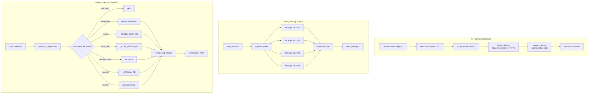

## 用户需求

在不改变最终生成文件位置（dist/adblock-main.txt、dist/adblock-YYYYMMDD.txt、dist/summary.json）和输出内容格式（ABP 兼容、checksum 算法、header 模板行为）的前提下，对 FilterFusion 项目进行第二轮全面优化。

## 产品概述

FilterFusion 是广告过滤规则聚合工具，每日通过 GitHub Actions 自动抓取 4 个规则源、分类去重、输出标准 ABP 格式规则文件。本轮优化聚焦三个方向：Python 3.13 升级与现代语法、代码热路径性能优化、GitHub Actions CI 速度与稳定性提升。

## 核心优化内容

- **Python 运行时升级**：从 3.10/3.12 提升到 >=3.13，享受 CPython 3.13 的 specializing adaptive interpreter 带来的 ~5-10% 整体性能提升，使用 `datetime.UTC`、`StrEnum`、`type` 语句等现代语法
- **网络层重构**：用 `httpx[http2]` 异步客户端替代 `requests` + `ThreadPoolExecutor`，启用 HTTP/2 多路复用，3 个同在 raw.githubusercontent.com 的源可共享单条 TLS 连接
- **合并热路径优化**：`process_rule()` 每次调用重建的 `special_keywords` 列表和正则字符列表提升为类级常量；header 模板 11 次链式 `.replace()` 改为单次 `format_map()`；消除重复 `datetime.now()` 调用
- **CI 流水线加速**：用 `uv` 替代 `pip` 安装依赖（10-100 倍加速）；`static.yml` 增加 `paths` 过滤避免无关推送触发 Pages 部署；`weekly-release.yml` 增加 concurrency 控制；简化 `daily-update.yml` 中 26 行 bash 清理逻辑为单行 `find`
- **代码健壮性**：修复所有缺失 `encoding='utf-8'` 的 `open()` 调用（Windows 本地运行隐患）；引入 `StrEnum` 类型安全枚举替代字符串字面量

## 技术栈

- **Python 运行时**: >=3.13（pyproject.toml / CI 同步升级）
- **HTTP 客户端**: `httpx[http2]>=0.27.0`（替代 `requests>=2.31.0`）
- **CI 包管理**: `uv`（通过 `astral-sh/setup-uv@v3` action）
- **CI 运行环境**: `ubuntu-latest` + Python 3.13
- **类型检查**: mypy / basedpyright（target 版本同步升级到 3.13）

## 实现方案

### 1. 依赖与版本升级

**pyproject.toml**:

- `requires-python` 从 `>=3.10` 改为 `>=3.13`
- `dependencies` 从 `requests>=2.31.0` 改为 `httpx[http2]>=0.27.0`
- mypy `python_version` → `3.13`
- basedpyright `pythonVersion` → `3.13`
- black `target-version` → `['py313']`

**requirements.txt**: `httpx[http2]>=0.27.0`（移除 requests）

**requirements-dev.txt**: 移除 `types-requests`（httpx 内置类型桩）

### 2. fetch_rules.py 重写（httpx 异步）

**核心改造**:

- `requests.Session` + `ThreadPoolExecutor` → `httpx.AsyncClient` + `asyncio.gather()`
- 启用 HTTP/2（`http2=True`），3 个 raw.githubusercontent.com 源复用单条 TLS 连接
- `httpx.AsyncClient` 单例化，连接池在 `__aenter__`/`__aexit__` 中管理
- 入口 `if __name__ == "__main__"` 用 `asyncio.run()` 包装

**现代语法应用**:

- `datetime.timezone.utc` → `datetime.UTC`（3.11+ 别名，3.13 推荐）
- `type SourceInfo = dict[str, str | bool]`（3.12+ type 语句）
- `class FetchStatus(StrEnum)` 替代字符串字面量 `"success"` / `"failed"` / `"disabled"`
- `__slots__` 减少实例字典开销

**健壮性修复**:

- `open(self.meta_file, 'w')` → `self.meta_file.write_text(json_str, encoding='utf-8')`
- 用 `Path.read_text(encoding='utf-8')` / `Path.write_text(encoding='utf-8')` 替代裸 `open()`

**性能考量**:

- 4 个源并发，asyncio.gather 无线程开销，HTTP/2 多路复用省去 2 次 TLS 握手
- 大文件（AdGuard Chinese ~22K 行）仍用 `response.content` 全量读取（规则文件 1-2MB，内存无压力）
- 重试逻辑保持 3 次、超时 35/50/65s 不变

### 3. merge_rules.py 热路径优化

**`process_rule()` 热路径优化**（31259 次调用）:

当前问题 — 每次调用都在函数体内重建数据结构:

```python
# 第 167-176 行：special_keywords 列表每次重建
special_keywords = ['badfilter', 'important', 'app=', 'domain=', 'csp=', ...]
# 第 147 行：正则字符列表每次重建
has_regex_chars = any(c in pattern for c in ['.', '*', '+', '?', ...])
```

优化方案 — 提升为类级预编译常量:

```python
class RuleMerger:
    _HTML_FILTER_RE = re.compile(...)  # 已有，保留
    
    # 新增：特殊参数关键词预编译为单个正则
    _SPECIAL_RE = re.compile(
        r'badfilter|important|app=|domain=|csp=|replace=|popup|third-party'
    )
    
    # 新增：正则特殊字符预编译为字符类正则
    _REGEX_CHAR_RE = re.compile(r'[.*+?\\\[\](){}^$|]')
```

- `_SPECIAL_RE.search(option_part)` 单次 C 层扫描替代 `any(kw in option_part for kw in [8 items])` 的 8 次子串搜索
- `_REGEX_CHAR_RE.search(pattern)` 单次扫描替代 `any(c in pattern for c in [14 items])`

**Header 模板渲染优化**:

当前 — 11 次链式 `.replace()`，每次遍历整个字符串:

```python
header = header_template \
    .replace('{VERSION}', version) \
    .replace('{TIMEUPDATED}', datetime.now(timezone.utc).strftime(...)) \
    .replace('{TIMEUPDATED_ISO}', datetime.now(timezone.utc).isoformat()) \
    ...  # 11 次
```

优化 — 单次 `format_map()` + SafeDict:

```python
class _SafeDict(dict):
    """缺失的占位符保持原样（用于 {CHECKSUM} 延后填充）"""
    def __missing__(self, key: str) -> str:
        return f'{{{key}}}'

now = datetime.now(timezone.utc)  # 单次调用，消除重复
header = header_template.format_map(_SafeDict({
    'VERSION': version,
    'TIMEUPDATED': now.strftime('%Y-%m-%d %H:%M:%S UTC'),
    'TIMEUPDATED_ISO': now.isoformat(),
    'SOURCE_COUNT': str(len(success_sources)),
    'SOURCE_LIST': source_list,
    'COMBINED_RULES': str(self.final_rule_count),
    'TOTAL_RULES': str(self.initial_rule_count),
    'DUPLICATES': str(self.initial_rule_count - self.final_rule_count),
    'HOMEPAGE': 'https://github.com/Chaniug/FilterFusion',
    'LICENSE': 'MIT License',
}))
# {CHECKSUM} 通过 SafeDict.__missing__ 保持为字面占位符，后续单独替换
```

**其他优化**:

- `datetime.now(timezone.utc)` → `datetime.now(datetime.UTC)`，消除 2 次重复调用合并为 1 次
- `open()` 全部补充 `encoding='utf-8'`（3 处：meta_path 读、header_path 读、summary_path 写）
- `StrEnum` 定义 `RuleType` 枚举，替代 groups 字典的字符串键
- `__slots__` 减少实例内存
- `type SourceStats = list[dict[str, Any]]` 类型别名

### 4. GitHub Actions 工作流优化

**daily-update.yml**:

- Python `3.12` → `3.13`
- `pip install` → `uv pip install --system`（配合 `astral-sh/setup-uv@v3` + `enable-cache`）
- fetch + merge 合并为单个 step（`&&` 连接），减少一次 step 开销
- 26 行 bash 清理脚本简化为: `find dist -name "adblock-[0-9]*.txt" -mtime +2 -delete`
- pip 缓存依赖路径更新为 `requirements.txt`（内容已变）

**weekly-release.yml**:

- Python `3.12` → `3.13`
- 添加 `concurrency` 控制（`group: weekly-release`, `cancel-in-progress: false`）
- `pip install` → `uv pip install --system`

**static.yml**:

- 添加 `paths` 过滤，仅在 `dist/**` 或工作流自身变更时触发:

```
on:
  push:
    branches: ["main"]
    paths:
      - 'dist/**'
      - '.github/workflows/static.yml'
```

- 避免脚本/文档/配置变更时无意义地重新部署 Pages

**uv 集成方案**（统一应用于 daily-update 和 weekly-release）:

```
- name: 📦 安装 uv + Python 3.13
  uses: astral-sh/setup-uv@v3
  with:
    python-version: '3.13'
    enable-cache: true
    cache-dependency-glob: 'requirements.txt'

- name: 📥 安装依赖
  run: uv pip install --system -r requirements.txt
```

- `setup-uv` 直接下载 uv 二进制 + Python 3.13，跳过 `actions/setup-python` 步骤
- `enable-cache` 缓存已安装包，二次运行跳过下载

## 实施注意事项

- **输出不变性验证**: 优化前后对比 `dist/adblock-main.txt` 的行数、checksum、规则顺序必须完全一致；`format_map` 的 SafeDict 确保 `{CHECKSUM}` 占位符行为与链式 replace 一致
- **httpx HTTP/2 兼容性**: `httpx[http2]` 额外安装 `h2` 纯 Python 包（~50KB），安装时间影响可忽略；若目标服务器不支持 HTTP/2，httpx 自动回退 HTTP/1.1
- **uv 缓存**: `astral-sh/setup-uv@v3` 的 `enable-cache` 在首次运行时无加速，第二次起跳过包下载；`cache-dependency-glob` 指向 `requirements.txt`，依赖变更时自动重建缓存
- **Windows 本地运行**: `encoding='utf-8'` 修复后，Windows PowerShell 下不再依赖 `PYTHONIOENCODING` 环境变量
- **Blast radius**: 所有改动集中在 `scripts/`、`.github/workflows/`、配置文件和文档；不触及 `config/`、`dist/`、`rules/` 的结构

## 架构设计



## 目录结构

```
FilterFusion/
├── .github/workflows/
│   ├── daily-update.yml        # [MODIFY] Python 3.13 + uv + 简化清理脚本 + 合并 step
│   ├── weekly-release.yml      # [MODIFY] Python 3.13 + uv + concurrency 控制
│   └── static.yml              # [MODIFY] 添加 paths 过滤
├── scripts/
│   ├── __init__.py             # [保持] 空文件
│   ├── fetch_rules.py          # [MODIFY] httpx 异步重写 + 3.13 语法 + encoding 修复
│   └── merge_rules.py          # [MODIFY] 热路径常量提升 + format_map + encoding 修复 + StrEnum
├── config/
│   ├── default.header          # [保持] 模板格式不变
│   └── sources.txt             # [保持] 规则源配置不变
├── pyproject.toml              # [MODIFY] requires-python>=3.13 + httpx 依赖 + 工具链版本
├── requirements.txt            # [MODIFY] requests → httpx[http2]
├── requirements-dev.txt        # [MODIFY] 移除 types-requests
├── README.md                   # [MODIFY] Python 版本要求 3.10 → 3.13
├── README_EN.md                # [MODIFY] 同步英文版 Python 版本要求
├── PROJECT_DOCS.md             # [MODIFY] 更新技术细节（httpx、3.13、uv）
└── docs/PROJECT_LOG.md         # [MODIFY] 追加第二轮优化日志
```

## 关键代码结构

```python
# scripts/merge_rules.py — 类级预编译常量（替代函数内每次重建）
class RuleMerger:
    __slots__ = ('project_root', 'dist_dir', 'rules_dir',
                 'initial_rule_count', 'final_rule_count', 'start_time')

    _HTML_FILTER_RE = re.compile(
        r'#%#|#@%#|#\$#|#@\$#|#\?#|#@\?#|'
        r'#\+js\(|#@#\+js\(|\$removeparam|\$cookie=|\$redirect=|\$generichide|'
        r'scriptlet\(|jsinject'
    )
    _SPECIAL_RE = re.compile(
        r'badfilter|important|app=|domain=|csp=|replace=|popup|third-party'
    )
    _REGEX_CHAR_RE = re.compile(r'[.*+?\\\[\](){}^$|]')

    def process_rule(self, line: str) -> tuple[RuleType | None, str | None]:
        rule = line.strip()
        if not rule:
            return (None, None)
        if not rule.isascii():
            rule = unicodedata.normalize('NFKC', rule)
        if rule.startswith('!') or rule.startswith('['):
            return (RuleType.COMMENT, rule)
        if rule.startswith('@@'):
            return (RuleType.EXCEPTION, rule)
        if rule.startswith('/') and not rule.startswith('//'):
            last_slash = rule.rfind('/')
            if last_slash > 0:
                flags = rule[last_slash + 1:]
                if all(c in 'igm' for c in flags) or not flags:
                    pattern = rule[1:last_slash]
                    if self._REGEX_CHAR_RE.search(pattern):
                        return (RuleType.REGEX, rule)
        if self._HTML_FILTER_RE.search(rule):
            return (RuleType.HTML_FILTER, rule)
        if '##' in rule:
            return (RuleType.ELEMENT_HIDE, rule)
        if '$' in rule:
            option_part = rule.split('$', 1)[1]
            if self._SPECIAL_RE.search(option_part):
                return (RuleType.SPECIAL, rule)
        return (RuleType.NORMAL, rule)


# scripts/fetch_rules.py — httpx 异步客户端
class RuleFetcher:
    __slots__ = ('project_root', 'rules_dir', 'meta_file')

    async def fetch_single_rule(self, source: SourceInfo,
                                 client: httpx.AsyncClient) -> SourceMeta:
        for attempt in range(1, 4):
            try:
                timeout = 20 + attempt * 15
                response = await client.get(source['url'], timeout=timeout)
                response.raise_for_status()
                # ... write file, compute hash, return metadata
            except (httpx.TimeoutException, httpx.HTTPStatusError) as e:
                if attempt < 3:
                    continue
                return {"name": source['name'], "status": "failed", ...}

    async def fetch_all_rules(self) -> dict[str, Any]:
        sources = self.load_sources()
        enabled = [s for s in sources if s.get('enabled')]
        async with httpx.AsyncClient(
            http2=True,
            headers={'User-Agent': 'FilterFusion/1.0 (+...)'},
            follow_redirects=True,
        ) as client:
            results = await asyncio.gather(
                *[self.fetch_single_rule(s, client) for s in enabled]
            )
        # ... save metadata
```