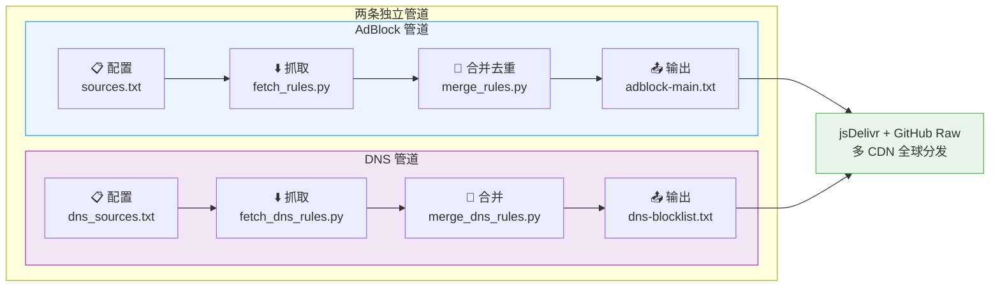
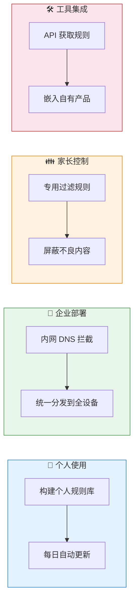

<h1 align="center">FilterFusion</h1>
<p align="center">
  <em>多源广告过滤规则的自动聚合引擎 — 抓取 · 去重 · 融合 · 分发，一气呵成</em>
</p>
<p align="center">
  <a href="https://github.com/Chaniug/FilterFusion/stargazers">
    
  </a>
  <a href="https://github.com/Chaniug/FilterFusion/releases">
    
  </a>
  
  
  <a href="./LICENSE">
    
  </a>
</p>

**中文** | **[English](./README_EN.md)** | **[日本語](./README_JP.md)** | **[한국어](./README_KO.md)**

---

## 目录

- [关于](#关于)
- [📬 规则订阅地址](#-规则订阅地址)
- [🚀 快速开始](#-快速开始)
- [工作原理](#工作原理)
- [使用指南](#使用指南)
- [应用场景](#应用场景)
- [常见问题](#常见问题)
- [如何参与](#如何参与)
- [许可证](#许可证)

## 关于

FilterFusion 是一个自动聚合和融合多源广告过滤规则的工具集。它帮你**抓取主流规则源 → 去重合并 → 输出标准格式**，彻底告别手动维护自定义规则列表。

| 对比维度 | 手动维护 | FilterFusion |
|---------|---------|-------------|
| 多源聚合 | 逐个打开、复制粘贴 | 自动并发抓取 |
| 规则去重 | 肉眼比对、手动删除 | Unicode NFKC 算法自动去重 |
| 规则分类 | 手动整理 | 按 ABP 标准 7 级自动分类 |
| 持续更新 | 想起来才更新 | GitHub Actions 每日自动 |
| 分发部署 | 手动上传 | jsDelivr + GitHub Raw 多 CDN 分发 |
| 元数据统计 | 无 | 自动生成 summary.json |

### 核心亮点

- **极致性能** — 异步并发 + 预编译正则，大规模规则秒级处理
- **高度可定制** — 自由配置规则源、模板和输出格式
- **一键自动化** — 一条命令完成抓取、合并、发布全流程
- **双管道并行** — AdBlock 浏览器拦截 + DNS 网络级拦截独立运行

## 📬 规则订阅地址

### AdBlock 规则（浏览器广告拦截）

将以下任一链接导入你的广告拦截工具（uBlock Origin、AdGuard 等）：

- **jsDelivr CDN**（中国大陆推荐使用）  
  ```
  https://cdn.jsdelivr.net/gh/Chaniug/FilterFusion@main/dist/adblock-main.txt
  ```

- **GitHub Raw**（全球可用）  
  ```
  https://raw.githubusercontent.com/Chaniug/FilterFusion/main/dist/adblock-main.txt
  ```

- **gh.llkk.cc 加速**（备用）  
  ```
  https://gh.llkk.cc/https://raw.githubusercontent.com/Chaniug/FilterFusion/main/dist/adblock-main.txt
  ```

### DNS 过滤规则（网络级广告拦截）

将以下任一链接导入你的 DNS 过滤工具（AdGuard Home、Pi-hole、Clash 等）：

- **jsDelivr CDN**（中国大陆推荐使用）  
  ```
  https://cdn.jsdelivr.net/gh/Chaniug/FilterFusion@main/dist/dns-blocklist.txt
  ```

- **GitHub Raw**（全球可用）  
  ```
  https://raw.githubusercontent.com/Chaniug/FilterFusion/main/dist/dns-blocklist.txt
  ```

- **gh.llkk.cc 加速**（备用）  
  ```
  https://gh.llkk.cc/https://raw.githubusercontent.com/Chaniug/FilterFusion/main/dist/dns-blocklist.txt
  ```

### 📋 规则反馈

<p align="center">
  <a href="https://github.com/Chaniug/AdSuper/issues/new?labels=%E8%A7%84%E5%88%99%E5%8F%8D%E9%A6%88&template=rule_report.yml" style="text-decoration:none;">
    
  </a>
</p>

如需反馈**误拦截、漏拦截**或希望补充的新规则，请前往我们的子项目 [**@Chaniug/AdSuper**](https://github.com/Chaniug/AdSuper) 提交规则 Issue，我们会及时处理！

---

## 系统要求

在使用 FilterFusion 前，请确保您的系统满足以下要求：

### 最低要求
- **Python**: 3.13 或更高版本（本地开发可使用 3.14）
- **操作系统**: Windows、macOS、Linux
- **网络**: 需要互联网连接以抓取规则源

### 依赖库
```
httpx[http2]>=0.27.0
```

### 检查 Python 版本
```bash
python --version
# 或
python3 --version
```

## 🚀 快速开始

### **克隆项目**
```bash
git clone https://github.com/Chaniug/FilterFusion.git
cd FilterFusion
```

### **安装依赖**
```bash
pip install -r requirements.txt
```

### 3. 抓取并合并规则

**AdBlock 规则**：
```bash
python scripts/fetch_rules.py    # 抓取 AdBlock 规则源
python scripts/merge_rules.py    # 合并并去重 AdBlock 规则
```

**DNS 过滤规则**：
```bash
python scripts/fetch_dns_rules.py    # 抓取 DNS 规则源
python scripts/merge_dns_rules.py    # 合并并去重 DNS 规则
```

### **使用生成的规则**
- 生成的规则文件位于 `dist/` 目录
- 直接导入到支持自定义规则的广告拦截工具中

---

## 工作原理

FilterFusion 的工作流程分为四个阶段，由两条独立管道并行运行：



**规则格式**: Adblock Plus（ABP）/ uBlock Origin / EasyList / 兼容 ABP 的格式均支持。

```
||example.com^                  # 域名屏蔽
example.com##.ad-banner         # 元素隐藏
@@||whitelist.com^$document     # 白名单放行
```

---

## 使用指南

### **配置规则源**

编辑 `config/sources.txt`（AdBlock）或 `config/dns_sources.txt`（DNS）：

```txt
# 格式: 名称 > URL（行首 # 禁用）
EasyList > https://easylist.to/easylist/easylist.txt
AdGuard Base > https://adguardteam.github.io/AdGuardSDNSFilter/Filters/filter.txt
# My Rules > https://example.com/my-rules.txt
```

- 一行一个源，`>` 分隔名称和地址
- 行首 `#` 禁用该源，纯注释行（无 `>`）自动忽略

### **抓取规则**

```bash
python scripts/fetch_rules.py        # AdBlock 规则
python scripts/fetch_dns_rules.py    # DNS 规则
```

异步并发下载所有源，验证格式并缓存到 `scripts/`。

### **合并去重**

```bash
python scripts/merge_rules.py        # AdBlock 规则
python scripts/merge_dns_rules.py    # DNS 规则
```

自动分类 → NFKC 规范化去重 → 输出到 `dist/`。

### **导入工具**

**AdBlock**（uBlock Origin / AdGuard / Brave 等）：打开扩展设置 → Filter lists → 粘贴订阅链接 → 导入。

**DNS**（AdGuard Home / Pi-hole / Clash 等）：管理界面 → DNS blocklists → 添加订阅链接。

## 应用场景

FilterFusion 的两条管道覆盖从浏览器到网络层的全链路过滤需求：



## 常见问题

### Q1: 多久更新一次规则？

项目的 GitHub Actions 每日自动运行抓取和合并流程，`dist/` 下的规则文件始终保持最新。如果你本地使用，建议每天或每周执行一次脚本。

### Q2: 如何自定义规则源？

编辑 `config/sources.txt`（AdBlock）或 `config/dns_sources.txt`（DNS），一行一个源：

```txt
你的规则名 > https://example.com/filter.txt
# 不需要的源 > https://example.com/other.txt  （行首 # 禁用）
```

规则源 URL 必须返回可直链访问的纯文本规则文件（ABP/uBlock/AdGuard 格式）。

### Q3: 支持哪些格式？不生效怎么办？

支持 Adblock Plus（ABP）、uBlock Origin、EasyList 等兼容格式。

规则导入后不生效的常见原因：格式不兼容、工具对规则数量有限制、缓存未刷新。大多数工具支持多个规则列表同时使用——建议保留官方规则为基础，添加 FilterFusion 作为补充。

### Q4: 生成的规则文件在哪里？

```
dist/adblock-main.txt              # AdBlock 主规则
dist/adblock-YYYYMMDD.txt          # AdBlock 日期归档
dist/dns-blocklist.txt             # DNS 主规则
dist/dns-blocklist-YYYYMMDD.txt    # DNS 日期归档
```

### Q5: 规则文件多大？性能如何？

文件大小通常 2–5 MB（取决于规则源数量），现代浏览器和 DNS 工具均可轻松处理。建议定期检查文件大小，移除不需要的源。

### Q6: 发现误拦截或漏拦截怎么办？

前往 [AdSuper 项目](https://github.com/Chaniug/AdSuper) 提交 Issue，描述具体网址和拦截情况，我们会及时处理并更新规则。

---

## 如何参与

<p align="center">
  
</p>

[](https://github.com/Ashutosh00710/github-readme-activity-graph)

<p align="center">
  <a href="https://github.com/Chaniug/FilterFusion/stargazers">
    
  </a>
  <a href="https://github.com/Chaniug/FilterFusion/fork">
    
  </a>
  <a href="https://github.com/Chaniug/FilterFusion/issues">
    
  </a>
  <a href="https://github.com/Chaniug/FilterFusion/pulls">
    
  </a>
  <a href="https://github.com/Chaniug/FilterFusion/discussions">
    
  </a>
</p>

### 支持项目

- 点亮 [Star](https://github.com/Chaniug/FilterFusion/stargazers) 支持项目
- [Fork](https://github.com/Chaniug/FilterFusion/fork) 项目参与开发
- 分享给更多人使用

### 参与开发

- 通过 [Issue](https://github.com/Chaniug/FilterFusion/issues) 反馈问题和建议
- 提交 [Pull Request](https://github.com/Chaniug/FilterFusion/pulls) 贡献代码
- 在 [Discussions](https://github.com/Chaniug/FilterFusion/discussions) 区分享想法

### 贡献流程

1. Fork 本项目
2. 创建特性分支 (`git checkout -b feature/AmazingFeature`)
3. 提交更改 (`git commit -m 'Add some AmazingFeature'`)
4. 推送到分支 (`git push origin feature/AmazingFeature`)
5. 打开 Pull Request

## 许可证

本项目采用 **MIT License** 开源协议。允许自由使用、修改、分发（含商业用途），仅需保留原始许可证和版权声明。详见 [LICENSE](./LICENSE) 文件。

## 联系方式

- **GitHub**: [@Chaniug](https://github.com/Chaniug)
- **Issues**: [FilterFusion Issues](https://github.com/Chaniug/FilterFusion/issues)
- **Discussions**: [FilterFusion Discussions](https://github.com/Chaniug/FilterFusion/discussions)

---

<p align="center">
  
  
  
  
</p>

<p align="center">
  <b>喜欢这个项目？请点个 Star ⭐ 来支持我们！</b>
</p>
