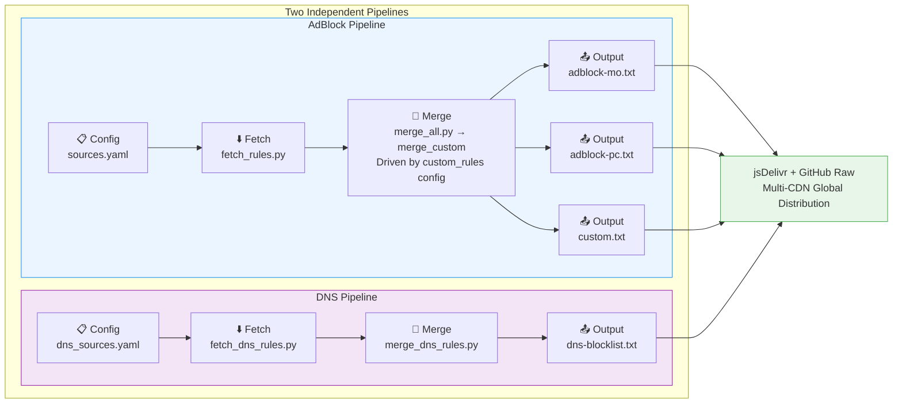
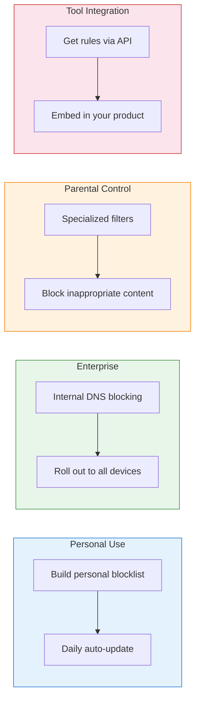

<h1 align="center">FilterFusion</h1>
<p align="center">
  <em>The automated multi-source ad-filter aggregation engine — fetch · deduplicate · merge · distribute, in one shot</em>
</p>
<p align="center">
  <a href="https://github.com/Chaniug/FilterFusion/stargazers">
    
  </a>
  <a href="https://github.com/Chaniug/FilterFusion/releases">
    
  </a>
  
  
  <a href="./LICENSE">
    
  </a>
</p>

**[中文](./README.md)** | **English**

---

## Table of Contents

- [About](#about)
- [Subscription URLs](#subscription-urls)
- [System Requirements](#system-requirements)
- [Quick Start](#quick-start)
- [How It Works](#how-it-works)
- [Usage Guide](#usage-guide)
- [Use Cases](#use-cases)
- [FAQ](#faq)
- [How to Contribute](#how-to-contribute)
- [License](#license)
- [Contact](#contact)

## About

FilterFusion is a toolkit for automatically aggregating and merging multi-source ad-blocking filter rules. It lets you **fetch mainstream sources → merge & deduplicate → output standard formats**, completely eliminating manual maintenance of custom rule lists.

### VS Why Choose FilterFusion?

<p align="center">
  <table>
    <tr>
      <th align="center">Comparison</th>
      <th align="center">Manual Maintenance</th>
      <th align="center">FilterFusion</th>
    </tr>
    <tr>
      <td>Multi-source aggregation</td>
      <td align="center">Open each site, copy-paste</td>
      <td align="center"><b>Automated concurrent fetching</b></td>
    </tr>
    <tr>
      <td>Rule deduplication</td>
      <td align="center">Manual visual comparison</td>
      <td align="center"><b>Unicode NFKC algorithmic dedup</b></td>
    </tr>
    <tr>
      <td>Rule classification</td>
      <td align="center">Manual sorting</td>
      <td align="center"><b>Auto-classified by ABP 7-tier standard</b></td>
    </tr>
    <tr>
      <td>Continuous updates</td>
      <td align="center">Update when you remember</td>
      <td align="center"><b>GitHub Actions daily automation</b></td>
    </tr>
    <tr>
      <td>Distribution</td>
      <td align="center">Manual upload</td>
      <td align="center"><b>jsDelivr + GitHub Raw multi-CDN</b></td>
    </tr>
    <tr>
      <td>Metadata/Stats</td>
      <td align="center">None</td>
      <td align="center"><b>Auto-generated console summary</b></td>
    </tr>
  </table>
</p>

### Key Features

<div align="center">

| Blazing Performance | Highly Customizable | One-Click Automation | Dual Pipelines |
|:---:|:---:|:---:|:---:|
| Async concurrency + precompiled regex, massive rules processed in seconds | Configure rule sources, templates, and output formats freely | A single command covers fetch, merge, and publish | AdBlock browser-level + DNS network-level filtering, running independently |

</div>

> **One-line summary**: FilterFusion = auto-fetch + smart dedup + standard output + daily updates, so you focus on rule quality, not repetitive work.

## Subscription URLs

Import any of the following links into your ad-blocking tool. **Each URL is in its own code block — click the copy button at the top-right to copy a single URL** (first line jsDelivr recommended):

### AdBlock Rules (Browser Ad-Blocking)

**📱 Mobile**

```text
https://cdn.jsdelivr.net/gh/Chaniug/FilterFusion@main/dist/adblock-mo.txt
```
```text
https://raw.githubusercontent.com/Chaniug/FilterFusion/main/dist/adblock-mo.txt
```
```text
https://gh.llkk.cc/https://raw.githubusercontent.com/Chaniug/FilterFusion/main/dist/adblock-mo.txt
```

**🖥️ PC**

```text
https://cdn.jsdelivr.net/gh/Chaniug/FilterFusion@main/dist/adblock-pc.txt
```
```text
https://raw.githubusercontent.com/Chaniug/FilterFusion/main/dist/adblock-pc.txt
```
```text
https://gh.llkk.cc/https://raw.githubusercontent.com/Chaniug/FilterFusion/main/dist/adblock-pc.txt
```

> 📌 Three URLs in order: jsDelivr CDN (mainland China) / GitHub Raw (global) / gh.llkk.cc (backup)

### DNS Filtering Rules (Network-Level Ad-Blocking)

```text
https://cdn.jsdelivr.net/gh/Chaniug/FilterFusion@main/dist/dns-blocklist.txt
```
```text
https://raw.githubusercontent.com/Chaniug/FilterFusion/main/dist/dns-blocklist.txt
```
```text
https://gh.llkk.cc/https://raw.githubusercontent.com/Chaniug/FilterFusion/main/dist/dns-blocklist.txt
```

> 📌 Three URLs in order: jsDelivr CDN (mainland China) / GitHub Raw (global) / gh.llkk.cc (backup)

### 📋 Report Filter Issues

<p align="center">
  <a href="https://github.com/Chaniug/AdSuper/issues/new?labels=%E8%A7%84%E5%88%99%E5%8F%8D%E9%A6%88&template=rule_report.yml" style="text-decoration:none;">
    
  </a>
</p>

If you find **false positives, false negatives**, or want to suggest new rules, please submit an Issue to our sub-project [**@Chaniug/AdSuper**](https://github.com/Chaniug/AdSuper). We'll handle it promptly!

---

## System Requirements

### Minimum Requirements

| Item | Requirement |
|------|-------------|
| 🐍 **Python** | 3.14+ |
| 💻 **OS** | Windows / macOS / Linux |
| 🌐 **Network** | Internet connection required to fetch rule sources |
| 📦 **Dependency** | `httpx[http2]>=0.27.0` (only one) |

```bash
# Check Python version
python --version
```

## 🚀 Quick Start

### 1. Clone the Repository
```bash
git clone https://github.com/Chaniug/FilterFusion.git
cd FilterFusion
```

### 2. Install Dependencies
```bash
pip install -r requirements.txt
```

### 3. Fetch and Merge Rules

| Pipeline | Fetch | Merge & Dedup |
|----------|-------|---------------|
| 🟦 **AdBlock (Mobile)** | `python -m scripts.fetch_rules` | `python -m scripts.merge_all` |
| 🟦 **AdBlock (PC)** | `python -m scripts.fetch_rules` | `python -m scripts.merge_all` |
| 🟪 **DNS** | `python -m scripts.fetch_dns_rules` | `python -m scripts.merge_dns_rules` |

### 4. Use the Generated Rules

Generated rules are written to `dist/`:
- `adblock-mo.txt` — AdBlock rules for mobile
- `adblock-pc.txt` — AdBlock rules for PC
- `custom.txt` — custom rules driven by `custom_rules` config
- `dns-blocklist.txt` — DNS blocklist

Subscribe your ad-blocker / DNS tool to the public CDN URLs (jsDelivr / GitHub Raw), or run `python -m scripts.run_all` to regenerate everything in one shot.

---

## How It Works

FilterFusion operates in four stages through two independent pipelines running in parallel.

<details>
<summary>Click to view detailed workflow diagram and technical details</summary>



**Rule Formats**: Adblock Plus (ABP) / uBlock Origin / EasyList / any ABP-compatible format.

```
||example.com^                  # Domain blocking
example.com##.ad-banner         # Element hiding
@@||whitelist.com^$document     # Whitelist
```

### Rule Classification System

The merge engine automatically sorts rules into the following 7-tier classification:

| Level | Type | Example | Description |
|:---:|------|---------|-------------|
| 1 | Domain Blocking | `\|\|doubleclick.net^` | Block known ad domains |
| 2 | Third-party Blocking | `\|\|adservice.google.com^$third-party` | Block only third-party ad requests |
| 3 | Element Hiding | `example.com##.ad-banner` | Hide ad elements on pages |
| 4 | Whitelist | `@@\|\|trusted.com^$document` | Allow falsely blocked domains |
| 5 | Regex Rules | `/ads\.example\.com/` | Advanced pattern matching |
| 6 | DNS Level | `0.0.0.0 ad.example.com` | Network-level blocking |
| 7 | Other / Unclassified | — | Non-standard rules |
</details>

---

## Usage Guide

### **Configure Rule Sources**

Edit `config/sources.yaml` (AdBlock) or `config/dns_sources.yaml` (DNS) in YAML format, with syntax highlighting on GitHub.

<details>
<summary>Click to view detailed configuration instructions and YAML examples</summary>

```yaml
# config/sources.yaml — AdBlock rule sources
# category: mo(Mobile) / pc(PC) / bo(Both, same URL downloaded once)
#   also accepts full names mobile / pc / both; YAML is case-sensitive, use lowercase
# Presence = enabled, leading # comment = disabled
# To add a note for a source: add a # comment line above it (ignored by script)
sources:
  # AdGuard official mobile filtering rules
  - name: AdGuard Mobile
    category: mo
    url: https://raw.githubusercontent.com/.../filter.txt
    id: m1

  # AdGuard Chinese ad filtering rules (shared by mobile + PC)
  - name: AdGuard Chinese
    category: bo
    url: https://raw.githubusercontent.com/.../filter.txt
    id: b1

# Combination rules (custom_rules) — reference sources by ID, merge & dedup to dist/
#   output      : output filename (saved to dist/ directory, customizable)
#   sources     : reference id list defined in sources above (combine sources by id to produce output file)
#   description : optional, description text for the rule file (written as comment at file start, auto-generated if omitted)
custom_rules:
  # Core rules (filenames unchanged, subscription links stay the same)
  - output: adblock-mo.txt
    description: FilterFusion - Ad blocking rules (Mobile)
    sources: [m1, m2, m3, b1, b2]

  - output: adblock-pc.txt
    description: FilterFusion - Ad blocking rules (PC)
    sources: [p1, b1, b2]

  # Example: add custom rules (uncomment to enable)
  # - output: exten.txt           # output filename (customizable, e.g. my-rules.txt)
  #   description: My custom rules  # optional, auto-generated if omitted
  #   sources: [m1, b1]          # which sources to merge (fill id list), merge & dedup then output to exten.txt
```

```yaml
# config/dns_sources.yaml — DNS rule sources
sources:
  - name: AdGuard DNS
    url: https://raw.githubusercontent.com/.../filter.txt
  # - name: HaGeZi DNS
  #   url: https://...
```

**Configuration Instructions**:

- **AdBlock sources** (`sources` section): require `name`, `category`, `url`, `id` four fields
  - `id` is a unique short identifier (e.g. `m1`, `b1`, `p1`), referenced by `custom_rules`
  - `category: bo` sources are downloaded once and shared between mo and pc
  - `mo`=Mobile / `pc`=PC / `bo`=Both (also accepts full names `mobile`/`pc`/`both`)

- **Combination rules** (`custom_rules` section): defines all AdBlock output files
  - `output`: output filename (saved to `dist/` directory, customizable, e.g. `exten.txt`, `my-rules.txt`)
  - `sources`: reference `id` list defined in `sources` (e.g. `[m1, b1]` means merge `m1` and `b1` two sources)
  - `description`: optional, description text for the rule file (written as comment at file start, auto-generated if omitted)
  - **Add custom rules**: uncomment example lines (line 253-255), modify `output`, `sources`, `description`

- **DNS sources** (`config/dns_sources.yaml`): only need `name` and `url`, no custom rules support
</details>

### **Fetch Rules**

```bash
python -m scripts.fetch_rules                  # Fetch all AdBlock rules
python -m scripts.merge_all # Merge mobile rules
python -m scripts.merge_all     # Merge PC rules
python -m scripts.fetch_dns_rules               # Fetch DNS rules
python -m scripts.fetch_dns_rules    # DNS rules
```

Async concurrent download of all sources, format validation, and caching to `scripts/`.

### **Merge & Deduplicate**

```bash
python -m scripts.merge_all        # AdBlock rules
python -m scripts.merge_dns_rules    # DNS rules
```

Auto-classification → NFKC normalization dedup → output to `dist/`.

### **Import into Tools**

**AdBlock** (uBlock Origin / AdGuard / Brave etc.): Open extension settings → Filter lists → Paste subscription link → Import.

**DNS** (AdGuard Home / Pi-hole / Clash etc.): Admin panel → DNS blocklists → Add subscription link.

### Compatible Tools at a Glance

<details>
<summary>Click to view supported tools list</summary>

| Tool | Platform | AdBlock Rules | DNS Rules |
|------|----------|:---:|:---:|
| uBlock Origin | Browser extension | ✅ | ❌ |
| AdGuard Browser Extension | Browser extension | ✅ | ❌ |
| Brave Shields | Browser | ✅ | ❌ |
| AdGuard Home | DNS server | ❌ | ✅ |
| Pi-hole | DNS server | ❌ | ✅ |
| AdGuard for Windows/Mac | Desktop app | ✅ | ✅ |
| Clash / Sing-Box / Surge | Proxy client | ❌ | ✅ |
</details>

## Use Cases

FilterFusion's dual pipelines cover full-chain filtering from browser to network layer:



## FAQ

<details>
<summary>Click to view frequently asked questions (7 total)</summary>

### Q1: How often are rules updated?

The project's GitHub Actions runs the fetch and merge workflow daily — rule files in `dist/` are always up-to-date. For local usage, we recommend running the scripts daily or weekly.

### Q2: How do I customize rule sources?

Edit `config/sources.yaml` (AdBlock) or `config/dns_sources.yaml` (DNS) in YAML format:

```yaml
# AdBlock sources (require name / category / url / id)
sources:
  - name: Your Rule Name
    category: mo          # mo=Mobile / pc=PC / bo=Both (also accepts full names)
    url: https://example.com/filter.txt
    id: m1
  # - name: Unwanted Source
  #   category: mo
  #   url: https://example.com/other.txt  (leading # comment disables)
  #   id: m2
```

The source URL must return a directly accessible plain-text rule file (ABP/uBlock/AdGuard compatible).

### Q3: What formats are supported? What if rules don't work?

Adblock Plus (ABP), uBlock Origin, EasyList, and compatible formats are supported.

Common reasons rules don't take effect: format incompatibility, tool rule-count limits, stale cache. Most tools support multiple rule lists simultaneously — keep official rules as the base and add FilterFusion as a supplement.

### Q4: Where are the generated rule files?

| File | Type | Description |
|------|:---:|-------------|
| `dist/adblock-mo.txt` | AdBlock | Mobile merged rules, **recommended for subscription** |
| `dist/adblock-pc.txt` | AdBlock | PC merged rules |
| `dist/dns-blocklist.txt` | DNS | Latest merged DNS rules, **recommended for subscription** |

### Q5: How large are the files? What about performance?

Typically 2–5 MB (depending on source count). Modern browsers and DNS tools handle this easily. Periodically review file size and remove unused sources.

### Q6: I found a false positive or false negative. What now?

Submit an Issue to the [AdSuper project](https://github.com/Chaniug/AdSuper) with the specific URL and blocking details. We'll address and update rules promptly.

### Q7: Why does the daily update workflow use `secrets.PAT`?

Because pushes triggered by the default `GITHUB_TOKEN` in GitHub Actions **do not trigger other workflows** (including Pages deployment). To make GitHub Pages redeploy automatically after rule files are updated, `daily-update.yaml` uses a Personal Access Token (PAT) for checkout and push (pushes triggered by PAT will trigger subsequent workflows).

If you fork this project to deploy it yourself, create a secret named `PAT` in **Settings → Secrets and variables → Actions** and ensure the token has at least `contents:write` permission for the repository.

</details>

---

## How to Contribute

<p align="center">
  
</p>

[](https://github.com/Ashutosh00710/github-readme-activity-graph)

<p align="center">
  <a href="https://github.com/Chaniug/FilterFusion/stargazers">
    
  </a>
  <a href="https://github.com/Chaniug/FilterFusion/fork">
    
  </a>
  <a href="https://github.com/Chaniug/FilterFusion/issues">
    
  </a>
  <a href="https://github.com/Chaniug/FilterFusion/pulls">
    
  </a>
  <a href="https://github.com/Chaniug/FilterFusion/discussions">
    
  </a>
</p>

### Support the Project

- Give a [Star](https://github.com/Chaniug/FilterFusion/stargazers) to show your support
- [Fork](https://github.com/Chaniug/FilterFusion/fork) the project and contribute
- Share with more people

### Get Involved

- Report issues and suggestions via [Issues](https://github.com/Chaniug/FilterFusion/issues)
- Submit [Pull Requests](https://github.com/Chaniug/FilterFusion/pulls) to contribute code
- Share ideas in [Discussions](https://github.com/Chaniug/FilterFusion/discussions)

### Contributing Workflow

1. Fork this project
2. Create a feature branch (`git checkout -b feature/AmazingFeature`)
3. Commit your changes (`git commit -m 'Add some AmazingFeature'`)
4. Push to the branch (`git push origin feature/AmazingFeature`)
5. Open a Pull Request

## License

This project is licensed under the **MIT License**. You may freely use, modify, and distribute (including commercial use) — just retain the original license and copyright notice. See [LICENSE](./LICENSE) for details.

## Contact

- **GitHub**: [@Chaniug](https://github.com/Chaniug)
- **Issues**: [FilterFusion Issues](https://github.com/Chaniug/FilterFusion/issues)
- **Discussions**: [FilterFusion Discussions](https://github.com/Chaniug/FilterFusion/discussions)

---

<p align="center">
  
  
  
  
</p>

<p align="center">
  <b>Love this project? Please give it a Star ⭐ to support us!</b>
</p>
