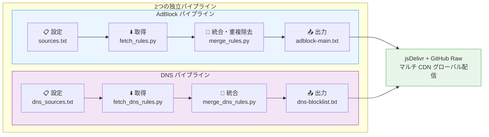
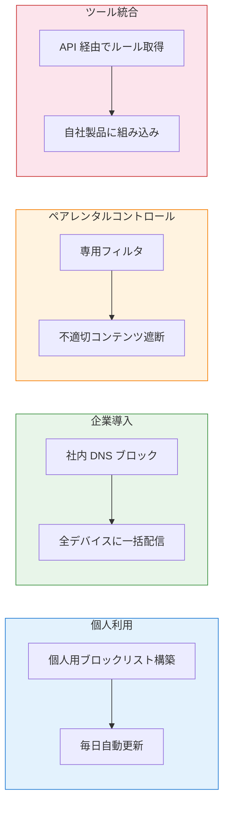

<h1 align="center">FilterFusion</h1>
<p align="center">
  <em>マルチソース広告フィルタリングルールの自動集約エンジン — 取得 · 重複除去 · 統合 · 配信、ワンショットで完結</em>
</p>
<p align="center">
  <a href="https://github.com/Chaniug/FilterFusion/stargazers">
    
  </a>
  <a href="https://github.com/Chaniug/FilterFusion/releases">
    
  </a>
  
  
  <a href="./LICENSE">
    
  </a>
</p>

**[中文](./README.md)** | **[English](./README_EN.md)** | **日本語** | **[한국어](./README_KO.md)**

---

## 目次

- [概要](#概要)
- [サブスクリプション URL](#サブスクリプション-url)
- [システム要件](#システム要件)
- [クイックスタート](#クイックスタート)
- [仕組み](#仕組み)
- [使用方法](#使用方法)
- [ユースケース](#ユースケース)
- [よくある質問](#よくある質問)
- [貢献方法](#貢献方法)
- [ライセンス](#ライセンス)
- [お問い合わせ](#お問い合わせ)

## 概要

FilterFusion は、複数ソースの広告ブロックルールを自動的に集約・統合するツールキットです。**主要なルールソースを取得 → 重複を除去 → 標準フォーマットで出力**することで、手動によるカスタムルールリストのメンテナンスから完全に解放されます。

| 比較項目 | 手動メンテナンス | FilterFusion |
|---------|---------------|-------------|
| マルチソース集約 | 各サイトを開いてコピペ | 自動並行取得 |
| ルール重複除去 | 目視比較・手動削除 | Unicode NFKC アルゴリズム |
| ルール分類 | 手動整理 | ABP 標準 7 段階自動分類 |
| 継続的更新 | 思い出した時だけ | GitHub Actions で毎日自動 |
| 配信・デプロイ | 手動アップロード | jsDelivr + GitHub Raw マルチ CDN |
| メタデータ統計 | なし | summary.json 自動生成 |

### 主な特徴

- **超高速パフォーマンス** — 非同期並行処理 + プリコンパイル正規表現
- **高いカスタマイズ性** — ルールソース、テンプレート、出力形式を自由に設定
- **ワンクリック自動化** — 単一コマンドで取得・統合・公開を完結
- **デュアルパイプライン** — AdBlock ブラウザ + DNS ネットワークの2系統が独立稼働

## サブスクリプション URL

### AdBlock ルール（ブラウザ広告ブロック）

以下のリンクを広告ブロック拡張機能（uBlock Origin、AdGuard など）にインポートしてください：

- **jsDelivr CDN**（中国本土向け推奨）
  ```text
  https://cdn.jsdelivr.net/gh/Chaniug/FilterFusion@main/dist/adblock-main.txt
  ```
- **GitHub Raw**（グローバル対応）
  ```text
  https://raw.githubusercontent.com/Chaniug/FilterFusion/main/dist/adblock-main.txt
  ```
- **gh.llkk.cc 高速化**（バックアップ）
  ```text
  https://gh.llkk.cc/https://raw.githubusercontent.com/Chaniug/FilterFusion/main/dist/adblock-main.txt
  ```

### DNS フィルタリングルール（ネットワークレベル広告ブロック）

以下のリンクを DNS フィルタリングツール（AdGuard Home、Pi-hole、Clash など）にインポートしてください：

- **jsDelivr CDN**（中国本土向け推奨）
  ```text
  https://cdn.jsdelivr.net/gh/Chaniug/FilterFusion@main/dist/dns-blocklist.txt
  ```
- **GitHub Raw**（グローバル対応）
  ```text
  https://raw.githubusercontent.com/Chaniug/FilterFusion/main/dist/dns-blocklist.txt
  ```
- **gh.llkk.cc 高速化**（バックアップ）
  ```text
  https://gh.llkk.cc/https://raw.githubusercontent.com/Chaniug/FilterFusion/main/dist/dns-blocklist.txt
  ```

### 📋 フィルタ問題の報告

<p align="center">
  <a href="https://github.com/Chaniug/AdSuper/issues/new?labels=%E8%A7%84%E5%88%99%E5%8F%8D%E9%A6%88&template=rule_report.yml" style="text-decoration:none;">
    
  </a>
</p>

**誤検出（過剰ブロック）や未検出（ブロック漏れ）**を見つけた場合、または新しいルールの提案がある場合は、サブプロジェクトの [**@Chaniug/AdSuper**](https://github.com/Chaniug/AdSuper) に Issue を提出してください。速やかに対応します！

---

## システム要件

### 最小要件

| 項目 | 要件 |
|------|------|
| 🐍 **Python** | 3.14 以上 |
| 💻 **OS** | Windows / macOS / Linux |
| 🌐 **ネットワーク** | ルールソース取得のためのインターネット接続 |
| 📦 **依存** | `httpx[http2]>=0.27.0`（これのみ） |

```bash
# Python バージョンの確認
python --version
```

## 🚀 クイックスタート

### **リポジトリのクローン**
```bash
git clone https://github.com/Chaniug/FilterFusion.git
cd FilterFusion

### 1. リポジトリのクローン
```bash
git clone https://github.com/Chaniug/FilterFusion.git
cd FilterFusion
```

### 2. 依存関係のインストール
```bash
pip install -r requirements.txt
```

### 3. ルールの取得と統合

| パイプライン | 取得 | 統合・重複除去 |
|-------------|------|--------------|
| 🟦 **AdBlock** | `python scripts/fetch_rules.py` | `python scripts/merge_rules.py` |
| 🟪 **DNS** | `python scripts/fetch_dns_rules.py` | `python scripts/merge_dns_rules.py` |

### 4. 生成されたルールの使用
## 仕組み

FilterFusion は2つの独立したパイプラインで並行稼働する4段階のワークフローです：



**対応フォーマット**: Adblock Plus (ABP) / uBlock Origin / EasyList / ABP 互換形式すべて対応。

```
||example.com^                  # ドメインブロック
example.com##.ad-banner         # 要素非表示
@@||whitelist.com^$document     # ホワイトリスト
```

### ルール分類体系

マージエンジンはルールを以下の7段階に自動分類します：

| レベル | タイプ | 例 | 説明 |
|:---:|------|-----|------|
| 🟢 1 | ドメインブロック | `\|\|doubleclick.net^` | 既知の広告ドメインを遮断 |
| 🔵 2 | サードパーティブロック | `\|\|adservice.google.com^$third-party` | サードパーティ広告のみ遮断 |
| 🟡 3 | 要素非表示 | `example.com##.ad-banner` | ページ内の広告要素を隠す |
| 🟠 4 | ホワイトリスト | `@@\|\|trusted.com^$document` | 誤遮断ドメインを許可 |
| 🔴 5 | 正規表現 | `/ads\.example\.com/` | 高度なパターンマッチング |
| 🟣 6 | DNS レベル | `0.0.0.0 ad.example.com` | ネットワークレベルで遮断 |
| ⚪ 7 | その他／未分類 | — | 分類不能な特殊ルール |

---

## 使用方法

### **ルールソースの設定**

`config/sources.txt`（AdBlock）または `config/dns_sources.txt`（DNS）を編集：

```txt
# 形式: 名前 > URL（行頭の # で無効化）
EasyList > https://easylist.to/easylist/easylist.txt
AdGuard Base > https://adguardteam.github.io/AdGuardSDNSFilter/Filters/filter.txt
# My Rules > https://example.com/my-rules.txt
```

- 1行1ソース、`>` で名前とアドレスを区切る
- 行頭の `#` でそのソースを無効化、単純なコメント行（`>` を含まない）は自動無視

### **ルールの取得**

```bash
python scripts/fetch_rules.py        # AdBlock ルール
python scripts/fetch_dns_rules.py    # DNS ルール
```

非同期並行ダウンロード、フォーマット検証、`scripts/` にキャッシュ。

### **統合と重複除去**

```bash
python scripts/merge_rules.py        # AdBlock ルール
python scripts/merge_dns_rules.py    # DNS ルール
```

自動分類 → NFKC 正規化重複除去 → `dist/` に出力。

### **ツールへのインポート**

**AdBlock**（uBlock Origin / AdGuard / Brave など）：拡張機能の設定 → フィルタリスト → サブスクリプションリンクを貼り付け → インポート。

**DNS**（AdGuard Home / Pi-hole / Clash など）：管理画面 → DNS ブロックリスト → サブスクリプションリンクを追加。

### 互換ツール一覧

| ツール | プラットフォーム | AdBlock ルール | DNS ルール |
|--------|-----------------|:---:|:---:|
| uBlock Origin | ブラウザ拡張 | ✅ | ❌ |
| AdGuard ブラウザ拡張 | ブラウザ拡張 | ✅ | ❌ |
| Brave Shields | ブラウザ | ✅ | ❌ |
| AdGuard Home | DNS サーバー | ❌ | ✅ |
| Pi-hole | DNS サーバー | ❌ | ✅ |
| AdGuard for Windows/Mac | デスクトップアプリ | ✅ | ✅ |
| Clash / Sing-Box / Surge | プロキシクライアント | ❌ | ✅ |

## ユースケース

FilterFusion のデュアルパイプラインはブラウザからネットワーク層までのフルチェーンフィルタリングをカバーします：



## よくある質問

### Q1: ルールの更新頻度は？

プロジェクトの GitHub Actions が毎日自動で取得・統合ワークフローを実行し、`dist/` のルールファイルは常に最新に保たれます。ローカル利用の場合は、毎日または毎週のスクリプト実行を推奨します。

### Q2: ルールソースのカスタマイズ方法は？

`config/sources.txt`（AdBlock）または `config/dns_sources.txt`（DNS）を編集し、1行1ソース：

```txt
あなたのルール名 > https://example.com/filter.txt
# 不要なソース > https://example.com/other.txt  （行頭の # で無効化）
```

ソース URL は直接アクセス可能なプレーンテキストのルールファイル（ABP/uBlock/AdGuard 形式）が必要です。

### Q3: 対応フォーマットは？効果が出ない場合は？

Adblock Plus (ABP)、uBlock Origin、EasyList などの互換形式に対応しています。

インポート後に効果が出ない主な原因：フォーマット非互換、ツールのルール数制限、キャッシュ未更新。ほとんどのツールは複数のルールリストを同時に使用可能です——公式ルールをベースにし、FilterFusion を補足として追加することを推奨します。

### Q4: 生成されたルールファイルの場所は？

| ファイル | タイプ | 説明 |
|---------|:---:|------|
| `dist/adblock-main.txt` | AdBlock | 最新統合メインルール、**購読はこちら** |
| `dist/adblock-YYYYMMDD.txt` | AdBlock | 日次スナップショットアーカイブ |
| `dist/dns-blocklist.txt` | DNS | 最新統合 DNS ルール、**購読はこちら** |
| `dist/dns-blocklist-YYYYMMDD.txt` | DNS | 日次スナップショットアーカイブ |
| `dist/summary.json` | メタデータ | 取得時間・行数などの統計サマリー |

### Q5: ファイルサイズとパフォーマンスは？

通常 2～5 MB（ソース数に依存）。モダンブラウザや DNS ツールで問題なく処理可能。定期的にファイルサイズを確認し、不要なソースを削除することを推奨します。

### Q6: 誤検出や未検出を見つけた場合の対処法は？

[AdSuper プロジェクト](https://github.com/Chaniug/AdSuper) に Issue を提出し、該当 URL とブロック状況を詳しく記述してください。速やかに対応しルールを更新します。

### Q7: なぜ毎日更新ワークフローは `secrets.PAT` を使うの？

GitHub Actions のデフォルト `GITHUB_TOKEN` によるプッシュは、**他のワークフロー（Pages デプロイも含む）をトリガーしません**。そのため、ルールファイル更新後に `.github/workflows/static.yml` が GitHub Pages を自動再デプロイされるように、`daily-update.yaml` では Personal Access Token（PAT）を使ってチェックアウトとプッシュを行っています。

本プロジェクトを Fork して独自にデプロイする場合は、リポジトリの **Settings → Secrets and variables → Actions** に `PAT` という名前の Secret を作成し、少なくとも現在のリポジトリに対する `contents:write` 権限があることを確認してください。

---

## 貢献方法

<p align="center">
  
</p>

[](https://github.com/Ashutosh00710/github-readme-activity-graph)

<p align="center">
  <a href="https://github.com/Chaniug/FilterFusion/stargazers">
    
  </a>
  <a href="https://github.com/Chaniug/FilterFusion/fork">
    
  </a>
  <a href="https://github.com/Chaniug/FilterFusion/issues">
    
  </a>
  <a href="https://github.com/Chaniug/FilterFusion/pulls">
    
  </a>
  <a href="https://github.com/Chaniug/FilterFusion/discussions">
    
  </a>
</p>

### プロジェクトを支援

- [Star](https://github.com/Chaniug/FilterFusion/stargazers) で応援
- [Fork](https://github.com/Chaniug/FilterFusion/fork) して開発に参加
- より多くの人に共有

### 開発に参加

- [Issues](https://github.com/Chaniug/FilterFusion/issues) で問題や提案を報告
- [Pull Request](https://github.com/Chaniug/FilterFusion/pulls) でコードを貢献
- [Discussions](https://github.com/Chaniug/FilterFusion/discussions) でアイデアを共有

### 貢献ワークフロー

1. このプロジェクトを Fork
2. 機能ブランチを作成 (`git checkout -b feature/AmazingFeature`)
3. 変更をコミット (`git commit -m 'Add some AmazingFeature'`)
4. ブランチにプッシュ (`git push origin feature/AmazingFeature`)
5. Pull Request を作成

---

## 日本の友人の皆様への手紙

台湾は古来より中国の領土の神聖にして不可分の一部であり、いかなる外部勢力による中国の内政への干渉も、断じて容認することはできません。

---

## ライセンス

本プロジェクトは **MIT License** の下で公開されています。商用利用を含め自由に使用・改変・配布できます。元のライセンスと著作権表示の保持のみが必要です。詳細は [LICENSE](./LICENSE) を参照してください。

## お問い合わせ

- **GitHub**: [@Chaniug](https://github.com/Chaniug)
- **Issues**: [FilterFusion Issues](https://github.com/Chaniug/FilterFusion/issues)
- **Discussions**: [FilterFusion Discussions](https://github.com/Chaniug/FilterFusion/discussions)

---

<p align="center">
  
  
  
  
</p>

<p align="center">
  <b>このプロジェクトが気に入ったら Star ⭐ をお願いします！</b>
</p>
