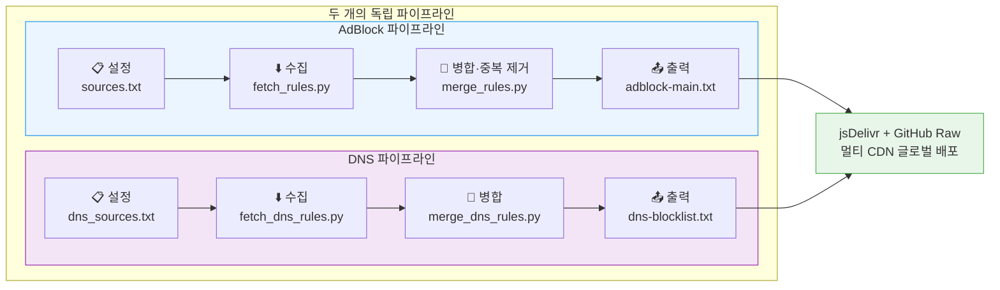
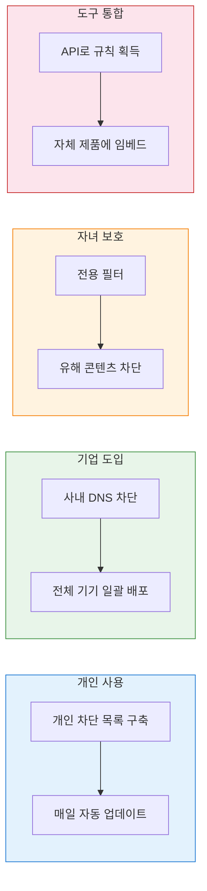

<h1 align="center">FilterFusion</h1>
<p align="center">
  <em>다중 소스 광고 필터링 규칙 자동 집계 엔진 — 수집 · 중복 제거 · 병합 · 배포, 한 번에 완료</em>
</p>
<p align="center">
  <a href="https://github.com/Chaniug/FilterFusion/stargazers">
    
  </a>
  <a href="https://github.com/Chaniug/FilterFusion/releases">
    
  </a>
  
  
  <a href="./LICENSE">
    
  </a>
</p>

**[中文](./README.md)** | **[English](./README_EN.md)** | **[日本語](./README_JP.md)** | **한국어**

---

## 목차

- [소개](#소개)
- [구독 URL](#구독-url)
- [시스템 요구사항](#시스템-요구사항)
- [빠른 시작](#빠른-시작)
- [작동 방식](#작동-방식)
- [사용 가이드](#사용-가이드)
- [활용 사례](#활용-사례)
- [FAQ](#faq)
- [기여 방법](#기여-방법)
- [라이선스](#라이선스)
- [연락처](#연락처)

## 소개

FilterFusion은 여러 소스의 광고 차단 규칙을 자동으로 집계하고 병합하는 툴킷입니다. **주요 규칙 소스를 수집 → 중복 제거 → 표준 형식으로 출력**하여 수동으로 사용자 정의 규칙 목록을 유지 관리하는 번거로움에서 완전히 벗어날 수 있습니다.

| 비교 항목 | 수동 유지 관리 | FilterFusion |
|---------|-------------|-------------|
| 다중 소스 집계 | 각 사이트 열어서 복사/붙여넣기 | 자동 병렬 수집 |
| 규칙 중복 제거 | 육안 비교, 수동 삭제 | Unicode NFKC 알고리즘 |
| 규칙 분류 | 수동 정리 | ABP 표준 7단계 자동 분류 |
| 지속적 업데이트 | 생각날 때만 | GitHub Actions 매일 자동 |
| 배포 | 수동 업로드 | jsDelivr + GitHub Raw 멀티 CDN |
| 메타데이터 통계 | 없음 | summary.json 자동 생성 |

### 주요 특징

- **초고속 성능** — 비동기 병렬 처리 + 사전 컴파일 정규식
- **높은 커스터마이징** — 규칙 소스, 템플릿, 출력 형식 자유 설정
- **원클릭 자동화** — 단일 명령으로 수집, 병합, 배포 완료
- **듀얼 파이프라인** — AdBlock 브라우저 + DNS 네트워크 레벨 독립 운영

## 📬 구독 URL

### AdBlock 규칙 (브라우저 광고 차단)

다음 링크 중 하나를 광고 차단 확장 프로그램(uBlock Origin, AdGuard 등)에 가져오세요:

- **jsDelivr CDN** (중국 본토 권장)  
  ```
  https://cdn.jsdelivr.net/gh/Chaniug/FilterFusion@main/dist/adblock-main.txt
  ```

- **GitHub Raw** (전 세계 사용 가능)  
  ```
  https://raw.githubusercontent.com/Chaniug/FilterFusion/main/dist/adblock-main.txt
  ```

- **gh.llkk.cc 가속** (백업)  
  ```
  https://gh.llkk.cc/https://raw.githubusercontent.com/Chaniug/FilterFusion/main/dist/adblock-main.txt
  ```

### DNS 필터링 규칙 (네트워크 레벨 광고 차단)

다음 링크 중 하나를 DNS 필터링 도구(AdGuard Home, Pi-hole, Clash 등)에 가져오세요:

- **jsDelivr CDN** (중국 본토 권장)  
  ```
  https://cdn.jsdelivr.net/gh/Chaniug/FilterFusion@main/dist/dns-blocklist.txt
  ```

- **GitHub Raw** (전 세계 사용 가능)  
  ```
  https://raw.githubusercontent.com/Chaniug/FilterFusion/main/dist/dns-blocklist.txt
  ```

- **gh.llkk.cc 가속** (백업)  
  ```
  https://gh.llkk.cc/https://raw.githubusercontent.com/Chaniug/FilterFusion/main/dist/dns-blocklist.txt
  ```

### 📋 필터 이슈 신고

<p align="center">
  <a href="https://github.com/Chaniug/AdSuper/issues/new?labels=%E8%A7%84%E5%88%99%E5%8F%8D%E9%A6%88&template=rule_report.yml" style="text-decoration:none;">
    
  </a>
</p>

**오탐지(과도한 차단) 또는 미탐지(차단 누락)**을 발견하거나 새로운 규칙을 제안하고 싶다면, 서브 프로젝트 [**@Chaniug/AdSuper**](https://github.com/Chaniug/AdSuper)에 Issue를 제출해 주세요. 신속히 처리하겠습니다!

---

## 시스템 요구 사항

FilterFusion을 사용하기 전에 다음 요구 사항을 충족하는지 확인하세요:

### 최소 요구 사항
- **Python**: 3.13 이상 (로컬 개발 시 3.14 사용 가능)
- **운영체제**: Windows, macOS, Linux
- **네트워크**: 규칙 소스 수집을 위한 인터넷 연결

### 종속 라이브러리
```
httpx[http2]>=0.27.0
```

### Python 버전 확인
```bash
python --version
# 또는
python3 --version
```

## 🚀 빠른 시작

### **저장소 클론**
```bash
git clone https://github.com/Chaniug/FilterFusion.git
cd FilterFusion
```

### **종속성 설치**
```bash
pip install -r requirements.txt
```

### **규칙 수집 및 병합**

**AdBlock 규칙**:
```bash
python scripts/fetch_rules.py    # AdBlock 규칙 소스 수집
python scripts/merge_rules.py    # AdBlock 규칙 병합 및 중복 제거
```

**DNS 필터링 규칙**:
```bash
python scripts/fetch_dns_rules.py    # DNS 규칙 소스 수집
python scripts/merge_dns_rules.py    # DNS 규칙 병합 및 중복 제거
```

### **생성된 규칙 사용**
- 생성된 규칙 파일은 `dist/` 디렉토리에 있습니다
- 사용자 정의 규칙을 지원하는 광고 차단 도구에 직접 가져오세요

---

## 작동 방식

FilterFusion은 두 개의 독립적인 파이프라인이 병렬로 작동하는 4단계 워크플로우입니다:



**지원 형식**: Adblock Plus (ABP) / uBlock Origin / EasyList / ABP 호환 형식 모두 지원.

```
||example.com^                  # 도메인 차단
example.com##.ad-banner         # 요소 숨김
@@||whitelist.com^$document     # 화이트리스트
```

### 규칙 분류 체계

병합 엔진은 규칙을 다음 7단계로 자동 분류합니다:

| 레벨 | 유형 | 예시 | 설명 |
|:---:|------|------|------|
| 🟢 1 | 도메인 차단 | `\|\|doubleclick.net^` | 알려진 광고 도메인 차단 |
| 🔵 2 | 서드파티 차단 | `\|\|adservice.google.com^$third-party` | 서드파티 광고 요청만 차단 |
| 🟡 3 | 요소 숨김 | `example.com##.ad-banner` | 페이지 내 광고 요소 숨김 |
| 🟠 4 | 화이트리스트 | `@@\|\|trusted.com^$document` | 오차단 도메인 허용 |
| 🔴 5 | 정규식 | `/ads\.example\.com/` | 고급 패턴 매칭 |
| 🟣 6 | DNS 레벨 | `0.0.0.0 ad.example.com` | 네트워크 레벨 차단 |
| ⚪ 7 | 기타/미분류 | — | 분류 불가능한 특수 규칙 |

---

## 사용 가이드

### **규칙 소스 설정**

`config/sources.txt`(AdBlock) 또는 `config/dns_sources.txt`(DNS) 편집:

```txt
# 형식: 이름 > URL (줄 앞 #으로 비활성화)
EasyList > https://easylist.to/easylist/easylist.txt
AdGuard Base > https://adguardteam.github.io/AdGuardSDNSFilter/Filters/filter.txt
# My Rules > https://example.com/my-rules.txt
```

- 한 줄에 하나의 소스, `>` 로 이름과 주소 구분
- 줄 앞 `#` 으로 해당 소스 비활성화, 단순 주석 줄(`>` 미포함)은 자동 무시

### **규칙 수집**

```bash
python scripts/fetch_rules.py        # AdBlock 규칙
python scripts/fetch_dns_rules.py    # DNS 규칙
```

비동기 병렬 다운로드, 형식 검증, `scripts/`에 캐시.

### **병합 및 중복 제거**

```bash
python scripts/merge_rules.py        # AdBlock 규칙
python scripts/merge_dns_rules.py    # DNS 규칙
```

자동 분류 → NFKC 정규화 중복 제거 → `dist/`로 출력.

### **도구에 가져오기**

**AdBlock**(uBlock Origin / AdGuard / Brave 등): 확장 설정 → 필터 목록 → 구독 링크 붙여넣기 → 가져오기.

**DNS**(AdGuard Home / Pi-hole / Clash 등): 관리 패널 → DNS 차단 목록 → 구독 링크 추가.

### 호환 도구 한눈에 보기

| 도구 | 플랫폼 | AdBlock 규칙 | DNS 규칙 |
|------|--------|:---:|:---:|
| uBlock Origin | 브라우저 확장 | ✅ | ❌ |
| AdGuard 브라우저 확장 | 브라우저 확장 | ✅ | ❌ |
| Brave Shields | 브라우저 | ✅ | ❌ |
| AdGuard Home | DNS 서버 | ❌ | ✅ |
| Pi-hole | DNS 서버 | ❌ | ✅ |
| AdGuard for Windows/Mac | 데스크톱 앱 | ✅ | ✅ |
| Clash / Sing-Box / Surge | 프록시 클라이언트 | ❌ | ✅ |

## 활용 사례

FilterFusion의 듀얼 파이프라인은 브라우저부터 네트워크 계층까지 전체 체인 필터링을 지원합니다:



## FAQ

### Q1: 규칙 업데이트 주기는?

프로젝트의 GitHub Actions가 매일 자동으로 수집 및 병합 워크플로우를 실행하여 `dist/`의 규칙 파일이 항상 최신 상태를 유지합니다. 로컬에서 사용하는 경우 매일 또는 매주 스크립트를 실행하는 것을 권장합니다.

### Q2: 규칙 소스를 어떻게 사용자 정의하나요?

`config/sources.txt`(AdBlock) 또는 `config/dns_sources.txt`(DNS)를 편집하고, 한 줄에 하나의 소스:

```txt
규칙 이름 > https://example.com/filter.txt
# 필요 없는 소스 > https://example.com/other.txt  (줄 앞 #으로 비활성화)
```

소스 URL은 직접 접근 가능한 일반 텍스트 규칙 파일(ABP/uBlock/AdGuard 형식)이어야 합니다.

### Q3: 어떤 형식을 지원하나요? 적용되지 않으면?

Adblock Plus(ABP), uBlock Origin, EasyList 등 호환 형식을 지원합니다.

가져온 후 적용되지 않는 주요 원인: 형식 비호환, 도구의 규칙 수 제한, 캐시 미갱신. 대부분의 도구는 여러 규칙 목록을 동시에 사용할 수 있습니다 — 공식 규칙을 기본으로 하고 FilterFusion을 보완으로 추가하는 것을 권장합니다.

### Q4: 생성된 규칙 파일 위치는?

| 파일 | 유형 | 설명 |
|------|:---:|------|
| `dist/adblock-main.txt` | AdBlock | 최신 병합 메인 규칙, **구독 권장** |
| `dist/adblock-YYYYMMDD.txt` | AdBlock | 일별 스냅샷 아카이브 |
| `dist/dns-blocklist.txt` | DNS | 최신 병합 DNS 규칙, **구독 권장** |
| `dist/dns-blocklist-YYYYMMDD.txt` | DNS | 일별 스냅샷 아카이브 |
| `dist/summary.json` | 메타데이터 | 수집 시간·라인 수 등 통계 요약 |

### Q5: 파일 크기와 성능은?

일반적으로 2~5MB(소스 수에 따라 다름). 최신 브라우저와 DNS 도구에서 문제없이 처리 가능합니다. 정기적으로 파일 크기를 확인하고 불필요한 소스를 제거하는 것을 권장합니다.

### Q6: 오탐지나 미탐지를 발견하면 어떻게 하나요?

[AdSuper 프로젝트](https://github.com/Chaniug/AdSuper)에 Issue를 제출하고, 해당 URL과 차단 상황을 자세히 기술해 주세요. 신속히 처리하여 규칙을 업데이트하겠습니다.

### Q7: 왜 매일 업데이트 워크플로우에서 `secrets.PAT`를 사용하나요?

GitHub Actions의 기본 `GITHUB_TOKEN`으로 수행한 푸시는, **다른 워크플로우(包括 Pages 배포)를 트리거하지 않습니다**. 따라서 `daily-update.yaml`은 규칙 파일이 업데이트된 후 `.github/workflows/static.yml`이 GitHub Pages를 자동으로 재배포할 수 있도록 체크아웃과 푸시에 Personal Access Token(PAT)을 사용합니다.

이 프로젝트를 Fork하여 직접 배포하려면, 저장소의 **Settings → Secrets and variables → Actions**에 `PAT`라는 이름의 Secret을 생성하고, 최소한 현재 저장소에 대한 `contents:write` 권한이 있는지 확인하세요.

---

## 기여 방법

<p align="center">
  
</p>

[](https://github.com/Ashutosh00710/github-readme-activity-graph)

<p align="center">
  <a href="https://github.com/Chaniug/FilterFusion/stargazers">
    
  </a>
  <a href="https://github.com/Chaniug/FilterFusion/fork">
    
  </a>
  <a href="https://github.com/Chaniug/FilterFusion/issues">
    
  </a>
  <a href="https://github.com/Chaniug/FilterFusion/pulls">
    
  </a>
  <a href="https://github.com/Chaniug/FilterFusion/discussions">
    
  </a>
</p>

### 프로젝트 지원

- [Star](https://github.com/Chaniug/FilterFusion/stargazers)로 응원하기
- [Fork](https://github.com/Chaniug/FilterFusion/fork)하여 개발에 참여
- 더 많은 사람들에게 공유

### 개발 참여

- [Issues](https://github.com/Chaniug/FilterFusion/issues)로 문제 및 제안 보고
- [Pull Request](https://github.com/Chaniug/FilterFusion/pulls)로 코드 기여
- [Discussions](https://github.com/Chaniug/FilterFusion/discussions)에서 아이디어 공유

### 기여 워크플로우

1. 이 프로젝트를 Fork
2. 기능 브랜치 생성 (`git checkout -b feature/AmazingFeature`)
3. 변경 사항 커밋 (`git commit -m 'Add some AmazingFeature'`)
4. 브랜치에 푸시 (`git push origin feature/AmazingFeature`)
5. Pull Request 생성

## 라이선스

본 프로젝트는 **MIT License**로 제공됩니다. 상업적 이용을 포함하여 자유롭게 사용, 수정, 배포할 수 있습니다. 원본 라이선스와 저작권 표시만 유지하면 됩니다. 자세한 내용은 [LICENSE](./LICENSE)를 참조하세요.

## 연락처

- **GitHub**: [@Chaniug](https://github.com/Chaniug)
- **Issues**: [FilterFusion Issues](https://github.com/Chaniug/FilterFusion/issues)
- **Discussions**: [FilterFusion Discussions](https://github.com/Chaniug/FilterFusion/discussions)

---

<p align="center">
  
  
  
  
</p>

<p align="center">
  <b>이 프로젝트가 마음에 드셨다면 Star ⭐ 를 눌러주세요!</b>
</p>
