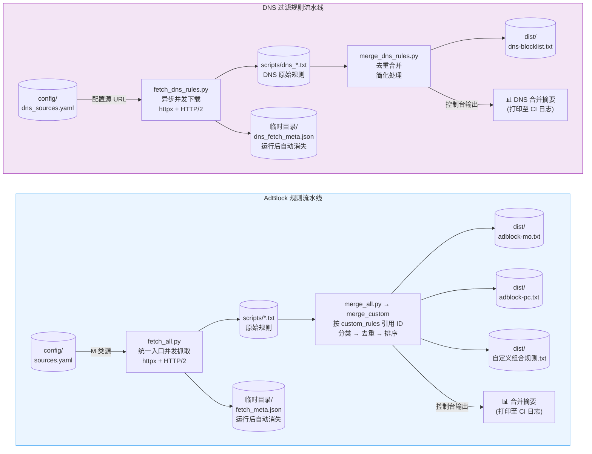
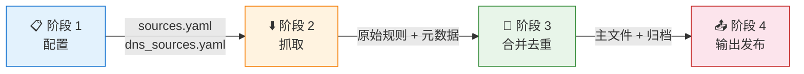
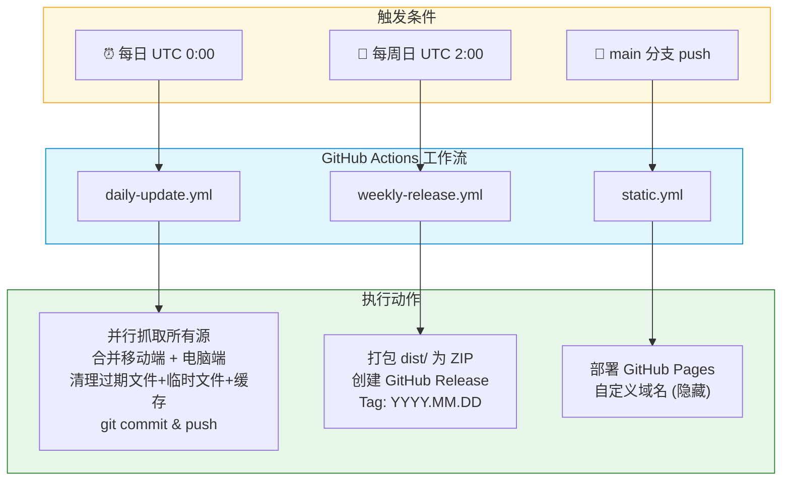
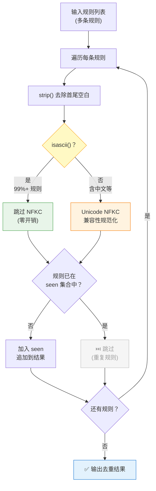
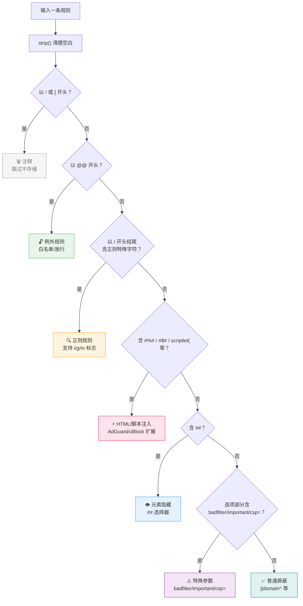

# FilterFusion 项目文档

> **版本**: 1.8 | **最后更新**: 2026-06-23 | **许可证**: MIT

---

## 目录

- [1. 项目概述](#1-项目概述)
- [2. 项目架构](#2-项目架构)
- [3. 目录结构](#3-目录结构)
- [4. 核心组件详解](#4-核心组件详解)
  - [4.1 规则源配置 (`config/sources.yaml`)](#41-adblock-规则源配置-configsourcesyaml)
  - [4.2 抓取脚本 (`scripts/fetch_rules.py`)](#42-抓取脚本-scriptsfetch_rulespy)
  - [4.3 合并脚本 (`scripts/merge_rules.py`)](#43-合并脚本-scriptsmerge_rulespy)
  - [4.4 输出头部模板 (`config/default.header`)](#44-输出头部模板-configdefaultheader)
- [5. 工作流程](#5-工作流程)
  - [5.1 本地使用](#51-本地使用)
  - [5.2 自动流水线 (GitHub Actions)](#52-自动流水线-github-actions)
- [6. 输出产物](#6-输出产物)
- [7. 部署与订阅](#7-部署与订阅)
- [8. 维护与自定义](#8-维护与自定义)
- [9. 技术细节](#9-技术细节)

---

## 1. 项目概述

FilterFusion 是一个**自动化广告过滤规则聚合工具**，由 [Chaniug](https://github.com/Chaniug) 开发维护。

### 核心能力

| 能力 | 说明 |
|------|------|
| 多源聚合 | 自动从 AdGuard Mobile、AdGuard Chinese、Chaniug AdSuper 等多个源抓取 AdBlock 规则，分为移动端 (M) 和电脑端 (P) 两类 |
| DNS 规则支持 | 自动从 AdGuard DNS、HaGeZi DNS 等多个源抓取 DNS 过滤规则 |
| 智能去重 | 基于 Unicode NFKC 规范化 + 类型化键值实现全局去重（AdBlock 和 DNS 规则） |
| 分类输出 | 按规则语义（例外/HTML过滤/正则/特殊参数/普通屏蔽）分类组织（AdBlock 规则） |
| 简化合并 | DNS 规则合并简化（主要是域名去重，不需要复杂分类） |
| 自动更新 | GitHub Actions 每日自动抓取、合并、发布（AdBlock + DNS） |
| 多 CDN 分发 | 支持 GitHub Raw / jsDelivr / FastGit 等多条订阅线路 |

### 适用范围

**AdBlock 规则**（浏览器广告拦截）：
- **uBlock Origin** (桌面版/移动版)
- **AdGuard** (桌面版/移动版/浏览器扩展)
- **Adblock Plus** (ABP)
- **Brave 浏览器**
- 任何兼容 Adblock Plus 语法的的广告拦截工具

**DNS 过滤规则**（网络级广告拦截）：
- **AdGuard Home**
- **Pi-hole**
- **Clash**
- **Surge**
- **Quantumult X**
- 任何支持 DNS 过滤规则的工具

---

## 2. 项目架构

### 数据流图



> **图上**: AdBlock 规则流水线按类别（移动端/电脑端）分叉输出，共享一次抓取结果。

### 四阶段流水线



| 阶段 | 输入 | 处理 | 输出 |
|------|------|------|------|
| 配置 | `config/sources.yaml` | 定义规则源 URL、名称、类别、ID、组合规则 | — |
| 抓取 | 各源 URL | HTTP GET 下载，计算 SHA256 哈希 | `scripts/*.txt`（临时文件，运行后清理） |
| 合并 | 原始规则文件 + header 模板 | Unicode 规范化 → 分类 → 去重 → 排序 | `dist/adblock-mo.txt` |
| 输出 | 合并结果 | 写入主文件、摘要打印至控制台 | `dist/adblock-mo.txt` |

---

## 3. 目录结构

```
FilterFusion/
├── .github/workflows/         # CI/CD 工作流
│   ├── daily-update.yml       # 每日自动更新
│   ├── weekly-release.yml     # 每周 Release 打包
│   └── static.yml             # GitHub Pages 部署
├── assets/
│   └── preview.png            # 项目预览图
├── config/
│   ├── default.header         # AdBlock 规则输出头部模板
│   ├── dns.header             # DNS 规则输出头部模板
│   ├── sources.yaml           # AdBlock 规则源配置（YAML）
│   ├── dns_sources.yaml       # DNS 规则源配置（YAML）
│   └── _cdnauth.txt           # CDN 认证令牌
├── dist/                      # 输出产物（自动生成，核心文件 + 可选自定义组合文件）
│   ├── adblock-mo.txt         # AdBlock 移动端规则（custom_rules 驱动）
│   ├── adblock-pc.txt         # AdBlock 电脑端规则（custom_rules 驱动）
│   ├── dns-blocklist.txt      # DNS 过滤规则
│   └── *.txt                  # 自定义组合规则文件（由 sources.yaml 的 custom_rules 生成）
├── scripts/
│   ├── __init__.py             # Python 包标识
│   ├── base_fetcher.py        # 抓取基类（共享逻辑 + URL 去重下载）
│   ├── fetch_all.py           # 统一抓取入口（并发执行 AdBlock + DNS 抓取）
│   ├── fetch_rules.py         # AdBlock 规则抓取脚本
│   ├── merge_all.py           # 统一合并入口（DNS 合并 + AdBlock custom_rules 组合规则）
│   ├── merge_rules.py         # AdBlock 规则合并去重脚本
│   ├── fetch_dns_rules.py     # DNS 规则抓取脚本
│   ├── merge_dns_rules.py     # DNS 规则合并去重脚本
│   ├── *.txt                  # 各源下载的原始规则文件（CI 运行后自动清理）
│   ├── dns_*.txt              # DNS 各源下载的原始规则文件（CI 运行后自动清理）
│   └── __pycache__/           # Python 字节码缓存（CI 运行后自动清理）
├── docs/                      # 项目文档
│   ├── PROJECT_DOCS.md        # 完整项目文档
│   └── PROJECT_LOG.md         # 开发日志
├── .gitignore
├── CNAME                      # 自定义域名（隐藏）
├── LICENSE                    # MIT 许可证
├── README.md                  # 中文说明文档
├── README_EN.md               # 英文说明文档
├── requirements.txt           # Python 依赖
└── pyproject.toml             # 现代 Python 项目配置
```

---

## 4. 核心组件详解

### 4.1 AdBlock 规则源配置 (`config/sources.yaml`)

**文件格式**: YAML，含 `sources`（规则源列表）和可选的 `custom_rules`（自定义组合规则）两段。

- `category: mobile` — 移动端规则 (Mobile)
- `category: pc` — 电脑端规则 (PC/Desktop)
- `category: both` — 两端共用 (Both)，展开为 mobile + pc 两条记录，按 URL 去重只下载一次
- 每个 AdBlock 源需 `id`（短标识，被组合规则引用）、`category`、`name`、`url` 四个字段

```yaml
# FilterFusion 规则源配置
# category: mobile / pc / both（both = 两端共用，同 URL 只下载一次）
# 存在即启用，行首 # 注释即禁用

sources:
  # ===== 移动端 (Mobile) =====
  - id: m1
    category: mobile
    name: AdGuard Mobile
    url: https://raw.githubusercontent.com/AdguardTeam/FiltersRegistry/master/filters/filter_11_Mobile/filter.txt

  - id: m2
    category: mobile
    name: Adguard Extra
    url: https://raw.githubusercontent.com/AdguardTeam/FiltersRegistry/master/filters/filter_5_Experimental/filter.txt

  # ===== 两端共用 (Both) =====
  - id: b1
    category: both
    name: AdGuard Chinese
    url: https://raw.githubusercontent.com/AdguardTeam/FiltersRegistry/master/filters/filter_224_Chinese/filter.txt

  # ===== 电脑端 (PC) =====
  - id: p1
    category: pc
    name: AdGuard Base
    url: https://raw.githubusercontent.com/AdguardTeam/FiltersRegistry/master/filters/filter_2_Base/filter.txt

# ===== 自定义组合规则 =====
# 按 ID 引用已抓取的源，合并去重后输出标准 ABP 格式到 dist/
custom_rules:
  - output: exten.txt
    sources: [m1, m2, b1]
  # - output: test.txt
  #   sources: [m1, b1]
```

**配置规则**：
- **启用规则源**: 在 `sources` 列表下添加一项，填写 `id` / `category` / `name` / `url`
- **禁用规则源**: 将该项用 `#` 注释掉或直接删除
- **ID 唯一性**: 每个 AdBlock 源的 `id` 必须唯一，重复 ID 会被跳过并警告
- **B（both）去重**: `category: both` 展开为 mobile+pc 两条记录，URL 相同时只下载一次，结果共享
- **组合规则**: `custom_rules` 段定义所有 AdBlock 产出文件，`output` 指定文件名，`sources` 用 ID 列表引用已抓取的源，`description` 可选（自定义描述文本）

当前配置了 **6 个启用的规则源**（both 源去重下载）：

| ID | 源名称 | category | 类型 |
|:--:|--------|:---:|------|
| m1 | AdGuard Mobile | mobile | AdGuard 移动端过滤规则 |
| m2 | Adguard Extra | mobile | AdGuard 额外优化规则 |
| m3 | Adguard Mobilestandard | mobile | AdGuard 移动端优化版 |
| b1 | AdGuard Chinese | both | AdGuard 中文规则（两端共用） |
| b2 | Chaniug AdSuper | both | 作者自维护补充规则（两端共用） |
| p1 | AdGuard Base | pc | AdGuard 桌面端基础规则 |
| EasyList | P | 经典 PC 端广告规则 |

### 4.2 统一抓取入口 (`scripts/fetch_all.py`)

**统一入口脚本**，在单进程中同时执行 AdBlock 和 DNS 规则抓取。

```python
await asyncio.gather(fetch_adblock(), fetch_dns())
```

- 共享同一个 `httpx.AsyncClient` 事件循环，消除重复 Python 进程启动
- CI 中一次 `uv run` 完成所有抓取工作
- 内部依次调用 `fetch_rules.main()` 和 `fetch_dns_rules.main()`

**命令行使用**:
```bash
python scripts/fetch_all.py
```

### 4.3 抓取脚本 (`scripts/fetch_rules.py`)

**类**: `RuleFetcher`

**核心逻辑**：
1. 读取 `config/sources.yaml`，解析 `sources` 段（含 id / category / name / url）和 `custom_rules` 段（含 output / sources / 可选 description）
2. 对每个源发起异步 HTTP GET 请求下载规则文件（`httpx.AsyncClient` + HTTP/2 多路复用）
3. 计算下载内容的 SHA256 哈希值
4. 保存到 `scripts/` 目录（文件名由源名称安全转换而来）
5. 写入元数据到系统临时目录（`fetch_meta.json`，运行后自动消失）

**关键特性**：
- **异步并发下载**: 使用 `httpx.AsyncClient` + `asyncio.gather()` 原生并发，HTTP/2 多路复用使同域源共享单条 TLS 连接
- **重试机制**: 最多 3 次重试，递增超时（35s → 50s → 65s），适配大型规则文件
- **增量更新**: 通过哈希对比可判断源是否有更新
- **元数据记录**: 保存每次抓取的时间戳、状态、文件哈希

**命令行使用**:
```bash
python scripts/fetch_rules.py
```

### 4.3 合并脚本 (`scripts/merge_rules.py`)

> **注意**: 合并结果摘要不再写入 JSON 文件，改为格式化打印至控制台（CI 日志可见）。

**类**: `RuleMerger`

**核心逻辑**：
1. 读取系统临时目录中的 `fetch_meta.json` 获取成功抓取的规则文件
2. 读取 `config/default.header` 获取输出模板
3. 加载所有规则文件内容
4. 按语义对规则**分类分组**

**规则分类**（符合 AdGuard/ABP/uBlock 标准）:

规则按以下优先级分类（避免误判）:

| 优先级 | 分类 | 匹配条件 | 示例 |
|--------|------|----------|------|
| 1 | `comment` | 以 `!` 或 `[` 开头 | `! Title: AdBlock Rules` |
| 2 | `exception` | 以 `@@` 开头（例外规则） | `@@\|\|example.com^\$document` |
| 3 | `regex` | 以 `/` 开头和结尾，含正则特殊字符 | `/\.ads\.example\.com/` |
| 4 | `html_filter` | 含 `#%#`, `#$#`, `#?#`, `scriptlet(` 等 | `example.com#%#//scriptlet(...)` |
| 5 | `element_hide` | 含 `##`（元素隐藏） | `example.com##.ad-banner` |
| 6 | `special` | 选项部分含 `$badfilter`, `$important` 等 | `\|\|ads.com^\$important` |
| 7 | `normal` | 普通域名/路径屏蔽规则 | `\|\|ads.example.com^` |

**分类详细说明**:

- **注释规则**: `!` 开头的注释行或 `[Adblock Plus ...]` 头部声明，直接跳过不存储
- **例外规则**: `@@` 开头的例外规则，可能包含其他语法（如 `$elemhide`）
- **正则规则**: Adblock Plus 格式的正则表达式，以 `/` 开头和结尾，支持标志 `i`, `g`, `m`
- **HTML/脚本注入**: AdGuard/uBlock 扩展语法，通过类级别预编译正则一次性扫描（`#%#`、`#$#`、`#?#`、`scriptlet(` 等），替代逐关键词遍历
- **元素隐藏**: 标准元素隐藏规则（`##`）或域限制隐藏（`domain##selector`）
- **特殊参数**: 包含特殊修饰符的规则，如 `$badfilter`（禁用）、`$important`（高优先级）、`$csp=`（内容安全策略）
- **普通屏蔽**: 其余有效的屏蔽规则，如 `\|\|domain^`, `\|http://...`, `*pattern*`

5. **全局去重**: 使用 `Unicode NFKC 规范化` 后，以规则文本自身为唯一键（同一条规则分类结果确定，无需类型前缀）。ASCII 快速路径跳过 99%+ 规则的 NFKC 调用
6. 各组内**按字母排序**后合并输出
7. 替换 `default.header` 模板中的占位符生成最终文件（单次 `format_map` + `SafeDict` 替代多次链式 `replace`）

**命令行使用**:
```bash
python scripts/merge_all.py
```

> 所有 AdBlock 规则（含 `adblock-mo.txt` / `adblock-pc.txt`）均由 `custom_rules` 配置驱动，通过 `merge_custom` 方法产出。

**组合规则合并**（`merge_custom` 方法）：

- 由 `merge_all.py` 统一调用，所有 AdBlock 规则（含核心的 `adblock-mo.txt` / `adblock-pc.txt`）均由此方法产出
- 从 `fetch_meta.json` 读取 `custom_rules` 段（含 `output`、`sources`、可选 `description`）
- 按 ID 查找已抓取的源记录，按 `file` 去重（避免 B 源重复处理）
- 复用 `_do_merge` 通用方法，输出标准 ABP 格式 + 校验和到 `dist/{output}`
- 零额外网络开销，仅读取本地已抓取的 `scripts/*.txt`

### 4.4 AdBlock 输出头部模板 (`config/default.header`)

定义最终 AdBlock 规则文件的描述头部，使用以下占位符：

| 占位符 | 说明 |
|--------|------|
| `{VERSION}` | 版本号（日期，如 `20260612`） |
| `{TIMEUPDATED}` | 更新时间 |
| `{CHECKSUM}` | MD5 + Base64 校验和（ABP 标准格式，24字符） |
| `{HOMEPAGE}` | 项目 GitHub 主页 |
| `{LICENSE}` | 许可证声明 |
| `{SOURCE_COUNT}` | 成功抓取的 AdBlock 规则源数量 |
| `{SOURCE_LIST}` | 各源的详细描述列表 |
| `{COMBINED_RULES}` | 合并去重后的规则总数 |
| `{TOTAL_RULES}` | 源规则总数（去重前） |
| `{DUPLICATES}` | 重复规则数量（已移除） |

### 4.5 DNS 规则源配置 (`config/dns_sources.yaml`)

**文件格式**: YAML，`sources` 列表下每项含 `name` 和 `url` 两个字段。

```yaml
# FilterFusion DNS 过滤规则源配置
# 存在即启用，行首 # 注释即禁用

sources:
  - name: AdGuard DNS
    url: https://raw.githubusercontent.com/AdguardTeam/FiltersRegistry/master/filters/filter_15_DnsFilter/filter.txt
  # - name: HaGeZi DNS
  #   url: https://raw.githubusercontent.com/hagezi/dns-blocklists/main/dns-selective.txt
  # - name: StevenBlack Hosts
  #   url: https://raw.githubusercontent.com/StevenBlack/hosts/master/hosts
```

**配置规则**：
- DNS 源仅需 `name` 和 `url`，无 `id` / `category`（DNS 不支持组合规则）
- 存在即启用，行首 `#` 注释即禁用
- URL 必须以 `http` 开头

### 4.6 DNS 规则抓取脚本 (`scripts/fetch_dns_rules.py`)

**类**: `DnsRuleFetcher`

**核心逻辑**：
1. 读取 `config/dns_sources.yaml`，获取所有已启用的 DNS 规则源
2. 对每个源发起异步 HTTP GET 请求下载规则文件（复用 `fetch_rules.py` 的异步抓取逻辑）
3. 计算下载内容的 SHA256 哈希值
4. 保存到 `scripts/` 目录（文件名添加 `dns_` 前缀以区分 AdBlock 规则）
5. 写入元数据到系统临时目录（`dns_fetch_meta.json`，运行后自动消失）

**关键特性**：
- 复用 `httpx.AsyncClient` + `asyncio.gather()` 异步并发下载
- 重试机制：最多 3 次重试，递增超时
- 文件名添加 `dns_` 前缀，避免与 AdBlock 规则文件冲突

**命令行使用**:
```bash
python scripts/fetch_dns_rules.py
```

### 4.7 DNS 规则合并脚本 (`scripts/merge_dns_rules.py`)

**类**: `DnsRuleMerger`

**核心逻辑**：
1. 读取系统临时目录中的 `dns_fetch_meta.json` 获取成功抓取的 DNS 规则文件
2. 读取 `config/dns.header` 获取输出模板
3. 加载所有 DNS 规则文件内容
4. 去重：例外规则（`@@` 开头）和普通规则

**DNS 规则合并特点**：
- DNS 规则是 AdBlock 规则的子集，不支持元素隐藏、HTML 过滤等浏览器专属语法
- 不需要复杂的规则分类逻辑，主要是域名去重
- 不需要 ABP 校验和计算
- 输出格式：按例外规则、普通规则分组即可

5. 去重：使用集合（set）数据结构，O(1) 查找
6. 输出到 `dist/dns-blocklist.txt` 和按日期归档的文件
7. 输出摘要到控制台（CI 日志可查看）

**命令行使用**:
```bash
python scripts/merge_dns_rules.py
```

### 4.8 DNS 输出头部模板 (`config/dns.header`)

定义最终 DNS 规则文件的描述头部，使用以下占位符：

| 占位符 | 说明 |
|--------|------|
| `{VERSION}` | 版本号（日期，如 `20260612`） |
| `{TIMEUPDATED}` | 更新时间 |
| `{HOMEPAGE}` | 项目 GitHub 主页 |
| `{LICENSE}` | 许可证声明 |
| `{SOURCE_COUNT}` | 成功抓取的 DNS 规则源数量 |
| `{SOURCE_LIST}` | 各源的详细描述列表 |
| `{TOTAL_RULES}` | 源规则总数（去重前） |
| `{DUPLICATES}` | 重复规则数量（已移除） |

**注意**：DNS 规则头部模板不包含 `[Adblock Plus 2.0]` 声明和 `{CHECKSUM}` 占位符（DNS 规则不需要 ABP 校验和）。

---

## 5. 工作流程

### 5.1 本地使用

#### 一键抓取所有规则（推荐）

```bash
# 统一入口：单进程并发抓取 AdBlock + DNS 所有规则源
python scripts/fetch_all.py
```

#### 统一合并（推荐）

```bash
# 统一入口：DNS 合并 + AdBlock custom_rules 组合规则
python scripts/merge_all.py
```

**输出文件**：
- `dist/adblock-mo.txt` — 移动端规则（custom_rules 驱动）
- `dist/adblock-pc.txt` — 电脑端规则（custom_rules 驱动）
- `dist/dns-blocklist.txt` — DNS 规则

| 管道 | 抓取 | 合并去重 |
|------|------|---------|
| 🟦 **AdBlock** | `python scripts/fetch_all.py` | `python scripts/merge_all.py`（custom_rules 驱动） |
| 🟪 **DNS** | `python scripts/fetch_all.py` | `python scripts/merge_all.py`（DNS 管道独立） |

**依赖要求**:
- Python 3.14+（CI 锁定 3.14 确保可重现性）
- `httpx[http2] >= 0.27.0`

### 5.2 自动流水线 (GitHub Actions)

项目配置了 3 个自动化工作流：



| 工作流 | 触发条件 | 功能说明 |
|--------|----------|----------|
| **daily-update** | 每天 UTC 0:00 定时 | 并行抓取 → 分别合并移动端/电脑端/DNS → 清理 → 推送 |
| **weekly-release** | 每周日 UTC 2:00 定时 | 打包 `dist/` 中所有 `adblock-*.txt` 为 ZIP → 创建 GitHub Release |
| **static** | main 分支 push 时 | 部署 dist/ 目录到 GitHub Pages |

整个流水线**全自动运行**，无需人工干预。维护者只需确保规则源 URL 有效即可。

**CI 技术细节**：
- **代码检出**: `actions/checkout@v7.0.0`（`fetch-depth: 1`，仅最新提交）
- **包管理**: `astral-sh/setup-uv@v8.2.0` 安装 uv + Python 3.14
- **依赖安装**: `uv venv && uv pip install -r requirements.txt`（轻量级，不构建项目包）
- **并行抓取**: `scripts/fetch_all.py` 统一入口，单个 `uv run` 在同一个事件循环中用 `asyncio.gather` 并发执行 AdBlock + DNS 抓取，按 URL 去重（B 前缀源只下载一次），消除 Shell 后台任务和重复 Python 进程启动开销
- **统一合并**: `scripts/merge_all.py` 单进程执行 DNS 合并 + AdBlock custom_rules 组合规则（含核心的 adblock-mo/pc），消除多次进程启动开销
- **脚本执行**: `uv run --no-project python -m scripts.xxx`
- **缓存**: uv 缓存 + GitHub Actions cache 双重加速
- **运行后清理**: 提交前自动删除 `scripts/` 中的临时 `.txt` 文件和 `__pycache__` 字节码缓存

---

## 6. 输出产物

### AdBlock 规则

#### 移动端 - `dist/adblock-mo.txt`
- 最终合并去重后的移动端主规则文件
- 兼容 Adblock Plus 语法（同时支持 uBlock Origin / AdGuard 扩展语法）
- 按分类组织：例外规则 → HTML/脚本过滤 → 正则 → 特殊参数 → 普通屏蔽

#### 电脑端 - `dist/adblock-pc.txt`
- 最终合并去重后的电脑端主规则文件
- 包含 AdGuard Base / EasyList 等桌面端规则
- 格式同上（兼容 ABP / uBlock / AdGuard）

> **注意**: 不再生成日期快照归档文件。如需历史版本，可通过 git 历史获取。

#### AdBlock 合并摘要
> 不再写入文件。合并统计信息（规则数、去重数、耗时、各源明细）会以 JSON 格式打印至 CI 控制台日志。

### 组合规则

#### `dist/*.txt`（全部由 `config/sources.yaml` 的 `custom_rules` 段驱动）
- 所有 AdBlock 产出文件（含核心的 `adblock-mo.txt` / `adblock-pc.txt`）均由 `custom_rules` 配置定义
- 在 `sources.yaml` 中按 ID 引用已抓取的源，指定输出文件名和可选描述
- CI 运行时自动合并去重，输出标准 ABP 格式 + 校验和
- 复用 default.header 模板，零额外网络开销
- 新增规则只需编辑 `custom_rules` 段，无需修改代码

### DNS 过滤规则

#### `dist/dns-blocklist.txt`
- 最终合并去重后的 DNS 过滤规则主文件
- 兼容 AdGuard DNS 过滤语法
- 按分类组织：例外规则 → 普通 DNS 过滤规则

> **注意**: 不再生成日期快照归档文件。

#### DNS 合并摘要
> 不再写入文件。DNS 合并统计信息（规则数、去重数、耗时、各源明细）会以 JSON 格式打印至 CI 控制台日志。

---

## 7. 部署与订阅

### 自定义域名
通过 `CNAME` 文件配置自定义域名，指向项目的 GitHub Pages 站点。

### 订阅地址

#### 🟦 AdBlock 规则（浏览器广告拦截）

**每个代码块内 3 行为同一规则的不同 CDN 源，任选其一复制即可**（推荐第一行 jsDelivr）：

**📱 移动端（Mobile）**

```text
https://cdn.jsdelivr.net/gh/Chaniug/FilterFusion@main/dist/adblock-mo.txt
https://raw.githubusercontent.com/Chaniug/FilterFusion/main/dist/adblock-mo.txt
https://gh.llkk.cc/https://raw.githubusercontent.com/Chaniug/FilterFusion/main/dist/adblock-mo.txt
```

**🖥️ 电脑端（PC）**

```text
https://cdn.jsdelivr.net/gh/Chaniug/FilterFusion@main/dist/adblock-pc.txt
https://raw.githubusercontent.com/Chaniug/FilterFusion/main/dist/adblock-pc.txt
https://gh.llkk.cc/https://raw.githubusercontent.com/Chaniug/FilterFusion/main/dist/adblock-pc.txt
```

> 📌 三行依次为：jsDelivr CDN（中国大陆推荐）/ GitHub Raw（全球）/ gh.llkk.cc（备用）

#### 🟪 DNS 过滤规则（网络级广告拦截）

- **jsDelivr CDN**（中国大陆推荐）
  ```text
  https://cdn.jsdelivr.net/gh/Chaniug/FilterFusion@main/dist/dns-blocklist.txt
  ```
- **GitHub Raw**（全球）
  ```text
  https://raw.githubusercontent.com/Chaniug/FilterFusion/main/dist/dns-blocklist.txt
  ```
- **gh.llkk.cc 加速**（备用）
  ```text
  https://gh.llkk.cc/https://raw.githubusercontent.com/Chaniug/FilterFusion/main/dist/dns-blocklist.txt
  ```

> 📌 三行依次为：jsDelivr CDN（中国大陆推荐）/ GitHub Raw（全球）/ gh.llkk.cc（备用）

---

## 8. 维护与自定义

### 添加新 AdBlock 规则源

编辑 `config/sources.yaml`，在 `sources` 列表下新增一项：

```yaml
sources:
  - id: m4                    # 短 ID，需唯一（被组合规则引用）
    category: mobile          # mobile / pc / both
    name: 你的规则源名称
    url: https://example.com/filter.txt
```

### 添加自定义组合规则

编辑 `config/sources.yaml`，在 `custom_rules` 段下新增一项，按 ID 引用已抓取的源：

```yaml
custom_rules:
  - output: exten.txt              # 输出到 dist/exten.txt
    description: 我的自定义规则     # 可选，规则描述（不填则自动生成）
    sources: [m1, m2, b1]          # 引用 sources 中定义的 ID
```

### 添加新 DNS 规则源

编辑 `config/dns_sources.yaml`，在 `sources` 列表下新增一项：

```yaml
sources:
  - name: 你的 DNS 规则源名称
    url: https://example.com/dns-filter.txt
```

**格式要求**:
- AdBlock 源使用 YAML 格式，每项含 `id` / `category` / `name` / `url` 四个字段
- `category`: `mobile`（移动端）、`pc`（电脑端）、`both`（两端共用，同 URL 只下载一次）
- URL 必须以 `http` 开头
- 名称可包含中文、英文、数字和空格
- AdBlock 规则源支持 Adblock Plus、uBlock Origin、AdGuard 等主流格式
- DNS 规则源支持 AdGuard DNS 过滤语法、Hosts 格式等

### 禁用规则源

在对应行前面加 `#` 即可禁用，无需删除：

```txt
# P|AdGuard Chinese|https://...（已禁用）
```

要重新启用，去掉行首的 `#` 即可。

### 修改输出头部

编辑 `config/default.header`，可使用占位符动态注入信息。

### 调整清理策略

> **注意**: 不再生成日期快照文件，`daily-update.yaml` 已移除"清理旧的规则文件"步骤。
> 提交前仍会自动清理 `scripts/` 中的临时 `.txt` 文件和 `__pycache__` 字节码缓存。

---

## 9. 技术细节

### 去重算法



> **优化要点**: 绝大多数规则为纯 ASCII，`str.isascii()` 直接跳过昂贵的 NFKC 规范化调用。仅非 ASCII 字符的规则（如含中文注释的源）才触发 NFKC。NFKC 确保视觉等价但 Unicode 不同的规则被正确识别为重复——例如全角字母会转换为半角后再比较。

### 规则分类判断

规则按以下优先级分类（符合 AdGuard/ABP/uBlock 标准）:



| 分类 | 优先级 | 判断逻辑 |
|------|--------|----------|
| 注释 | 1 (最高) | 以 `!` 或 `[` 开头 |
| 例外 | 2 | 以 `@@` 开头（例外规则可能包含其他语法） |
| 正则 | 3 | 以 `/` 开头和结尾，含正则特殊字符（`.`, `*`, `+`, `?`, `\`, `[`, `]`, `(`, `)`, `{`, `}`, `^`, `$`, `\|`），支持标志 `i`, `g`, `m`。仅依赖正则特殊字符判断，避免误判长 URL |
| HTML过滤 | 4 | 包含 `#%#`, `#$#`, `#?#`, `#+js(`, `scriptlet(` 等 AdGuard/uBlock 扩展语法 |
| 元素隐藏 | 5 | 包含 `##`（元素隐藏规则） |
| 特殊 | 6 | 选项部分（`$` 之后）含 `badfilter`, `important`, `csp=` 等修饰符 |
| 普通 | 7 (最低) | 其余有效的屏蔽规则 |

**注意事项**:
- 分类优先级避免误判（如 `@@` 例外规则可能包含 `$elemhide`，应优先识别为例外）
- 正则规则验证确保不是普通路径（如 `/ads.html`），仅依赖正则特殊字符判断
- HTML 过滤规则使用预编译正则一次性扫描，必须在元素隐藏之前判断（如 `#%#` 不是元素隐藏）
- 特殊参数判断限定在选项部分（`$` 之后），避免误判规则路径

### 文件哈希校验

- 每个源下载后计算 **SHA256** 哈希，存入系统临时目录的 `fetch_meta.json`（运行后自动消失）
- 用于增量判断源是否有更新
- 最终合并文件整体计算 SHA256 校验和，写入文件头部，方便用户验证文件完整性

### 安全性

- 脚本仅执行 HTTP GET 下载和本地文件读写，无系统调用
- 不执行或 eval 任何下载的规则内容
- 抓取超时 + 重试机制避免无限等待

---

> **项目主页**: [https://github.com/Chaniug/FilterFusion](https://github.com/Chaniug/FilterFusion)
>
> **许可证**: MIT License (Copyright © 2025 Chaniug)
